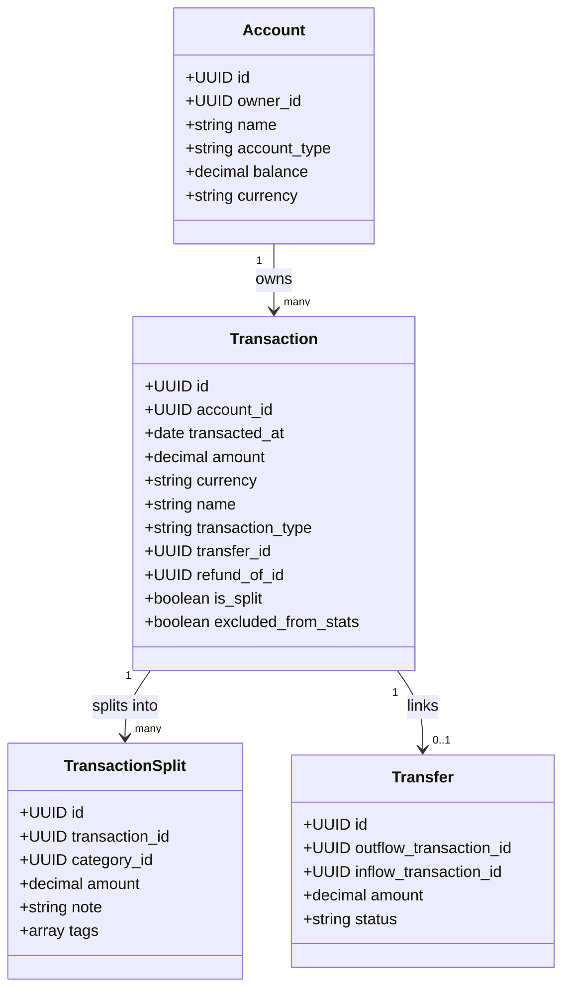

# FamLedger 全栈升级与架构实现蓝图（基于最终决策）

> **文档版本**：v2.1 (FamLedger Approved Blueprint)  
> **项目更名**：由原 Mosaic 全面升级并更名为 **FamLedger**（含专属 Logo、中英文双语支持与低内存高性能流水引擎）  
> **依据指令**：[`answer1.md`](file:///home/wln/famwealth/answer1.md)（用户架构指引）与 [`ref1.md`](file:///home/wln/famwealth/ref1.md)（高级规则引擎设计规范）  
> **项目定位**：基于 **FastAPI + React 18 + PostgreSQL** 全栈现代化重构，前端像素级复刻 **sure-web** 的设计系统与交互体验，全面支持**中英文双语、多用户、可配置 OIDC、单家庭细粒度共享、静默自动转账匹配、跨账户退款冲抵、交易拆分（Split）**、**基于虚拟滚动的 60FPS 低内存筛选引擎**以及基于 **Specification + Composite + Command + Pipeline** 的企业级高级规则引擎。

---

## 目录

1. [最终架构决策与核心共识](#1-最终架构决策与核心共识)
2. [品牌形象与中英文双语架构 (FamLedger & i18n)](#2-品牌形象与中英文双语架构-famledger--i18n)
   - 2.1 [专属 Logo 与品牌规范](#21-专属-logo-与品牌规范)
   - 2.2 [中英文双语 (i18n) 架构与本地化适配](#22-中英文双语-i18n-架构与本地化适配)
3. [前端改造方案：Sure Design System 复刻](#3-前端改造方案sure-design-system-复刻)
   - 3.1 [设计代币与 Tailwind Tokens 规范](#31-设计代币与-tailwind-tokens-规范)
   - 3.2 [React 版 Sure UI 组件库建设](#32-react-版-sure-ui-组件库建设)
   - 3.3 [布局体系与页面重构](#33-布局体系与页面重构)
4. [低内存与 60FPS 极速账单筛选引擎](#4-低内存与-60fps-极速账单筛选引擎)
   - 4.1 [深度剖析：为什么 sure-web 在内网都会卡顿？](#41-深度剖析为什么-sure-web-在内网都会卡顿)
   - 4.2 [FamLedger 破局方案：虚拟滚动列表 (Virtual Windowing)](#42-famledger-破局方案虚拟滚动列表-virtual-windowing)
   - 4.3 [毫秒级游标分页与 PostgreSQL 复合覆盖索引](#43-毫秒级游标分页与-postgresql-复合覆盖索引)
   - 4.4 [极轻 JSON Payload 与 Python 低内存非阻塞运行时](#44-极轻-json-payload-与-python-低内存非阻塞运行时)
5. [核心记账与领域模型设计（支持 Split 与 Transfer）](#5-核心记账与领域模型设计支持-split-与-transfer)
   - 5.1 [交易与分拆模型（Transaction & Split）](#51-交易与分拆模型transaction--split)
   - 5.2 [转账双向绑定模型（Transfer Linkage）](#52-转账双向绑定模型transfer-linkage)
6. [单家庭多成员与细粒度账户授权模型](#6-单家庭多成员与细粒度账户授权模型)
   - 6.1 [单家庭组织与成员角色](#61-单家庭组织与成员角色)
   - 6.2 [细粒度账户共享（Owner + AccountShare）](#62-细粒度账户共享owner--accountshare)
7. [OIDC / SSO 可配置认证中心](#7-oidc--sso-可配置认证中心)
   - 7.1 [配置驱动的 SSO 提供商体系](#71-配置驱动的-sso-提供商体系)
   - 7.2 [JIT 自动建号与绑定策略](#72-jit-自动建号与绑定策略)
8. [转账与退款匹配引擎落地细节](#8-转账与退款匹配引擎落地细节)
   - 8.1 [静默自动转账匹配（$\le 2$ 天同额自动合并 + 汇率容差）](#81-静默自动转账匹配le-2-天同额自动合并--汇率容差)
   - 8.2 [跨账户退款冲抵与当期平抑算法](#82-跨账户退款冲抵与当期平抑算法)
9. [高级规则引擎（深度吸收 ref1.md 架构）](#9-高级规则引擎深度吸收-ref1md-架构)
   - 9.1 [四位一体设计模式架构](#91-四位一体设计模式架构)
   - 9.2 [条件树（Specification + Composite）与 Regex 支持](#92-条件树specification--composite与-regex-支持)
   - 9.3 [解耦的动作系统（Command）](#93-解耦的动作系统command)
   - 9.4 [流水线执行与控制（Pipeline + Priority + Stop）](#94-流水线执行与控制pipeline--priority--stop)
   - 9.5 [历史回溯（Dry Run 预览 + 异步任务 + 字段修改来源标记）](#95-历史回溯dry-run-预览--异步任务--字段修改来源标记)
   - 9.6 [规则 Pipeline 网页端可视化编辑与交互设计](#96-规则-pipeline-网页端可视化编辑与交互设计)
10. [招行账单自动化（famledger-bill）API 管道集成](#10-招行账单自动化famledger-billapi-管道集成)
11. [PostgreSQL 18+ 核心数据库 DDL 清单](#11-postgresql-16-核心数据库-ddl-清单)
12. [REST API 接口规范契约](#12-rest-api-接口规范契约)
13. [老数据迁移脚本与分阶段落地路线图](#13-老数据迁移脚本与分阶段落地路线图)

---

## 1. 最终架构决策与核心共识

根据用户的明确指示（[`answer1.md`](file:///home/wln/famwealth/answer1.md)），本次升级的技术与业务基石全面确立：

| 决策维度 | 选定方案 | 核心业务规则与技术实现 |
| :--- | :--- | :--- |
| **技术栈选型** | **方案 1A (FastAPI + React 18)** | 维持 Python FastAPI 极致性能与 React SPA 流畅度，升级数据库为 PostgreSQL 18+。 |
| **核心记账模型** | **方案 2B + 拆分支持 (Split)** | 账户条目 + 双向 Transfer 关联，严格区分 `transaction_type`，支持一笔交易拆分为多个分类子项。 |
| **转账自动匹配** | **静默自动匹配 (Auto-commit)** | 日期相差 $\le 2$ 天、金额相同、不同账户一出一进，**直接自动合并为转账**；支持跨币种汇率容差匹配。 |
| **跨期退款处理** | **策略 B（当期负向平抑）** | 退款冲抵当月支出总额，不追溯篡改历史月份报表，支持原消费与退款明细溯源。 |
| **跨账户退款** | **允许跨账户冲抵** | 同属家庭内的账户，允许用账户 B 的退款冲抵账户 A 的历史消费。 |
| **多用户与家庭** | **单家庭多成员 + 细粒度授权** | 系统全局定位为**单家庭**；账户设独立 Owner，拥有者可授权家庭成员 `Read-Only` / `Read-Write` / `Full-Control`。 |
| **OIDC / SSO** | **可配置化 JIT / 策略驱动** | 对标 sure-web，支持动态配置 OIDC 提供商、JIT 开关、指定默认角色与邮箱白名单。 |
| **招行账单集成** | **模式 A（API 管道模式）** | `sure/bill` 作为独立抓取 Worker，通过 REST API 将流水推入系统，由系统统一跑规则与转账匹配。 |
| **规则引擎** | **高级组合式模式 + Regex** | Specification + Composite + Command + Pipeline，支持 Regex、条件树、多动作、Dry Run 预览回溯。 |

---

## 2. 品牌形象与中英文双语架构 (FamLedger & i18n)

### 2.1 专属 Logo 与品牌规范
- **品牌名称**：**FamLedger**（代表 Family + Ledger，家庭财富基石与清晰账目流转）。
- **专属矢量 Logo (`famledger_logo.svg`)**：
  - 设计语言：深度契合 Sure Design System 的极简黑白灰基底与微圆角质感（暗色模式深邃渐变底座 + 0.1 边框高光）。
  - 核心图形符号：由几何化的“F”与“L”立柱交织成一本展开的账本，中间融入象征资金流动、转账平衡与家庭共同财富增长的绿色双向阶梯梁，辅以深邃蓝微光斑点缀。
  - 规范文件路径：[`/home/wln/famwealth/famledger_logo.svg`](file:///home/wln/famwealth/famledger_logo.svg)，可直接导出为 Web Favicon、PWA 图标及 Desktop 应用图标。

### 2.2 中英文双语 (i18n) 架构与本地化适配
- **前端国际化方案**：采用 `i18next` + `react-i18next` 现代化方案。
  - 语言资源文件：
    - `frontend/src/locales/zh-CN.json`（简体中文，默认）
    - `frontend/src/locales/en-US.json`（English）
  - 语言检测与持久化：优先读取用户登录账号的 `users.locale` 偏好；未登录时根据浏览器 `navigator.language` 自动适配，并持久化到 LocalStorage。
  - 一键快速切换：顶部导航与用户个人偏好设置均提供语言快速切换入口（中文 / English），无需刷新整页。
- **交易分类（Categories）国际化对照策略**：
  - **内置双语对照字典**：系统预设分类使用国际化标识（如 `category.food_dining`）。切换为英文时，“餐饮美食”自动显示为“Dining & Food”；
  - **用户自定义分类**：用户自己手动新增的分类属于个人资产，录入什么就原样显示什么，系统不做强制翻译干预。
- **日期与多币种汇率管理**：
  - 中文环境：采用 `YYYY-MM-DD` 格式，金额符号前置 `¥`；
  - 英文环境：支持自由切换 `MM/DD/YYYY` 或 `DD/MM/YYYY`，货币跟随家庭或账户本位币符号（`$`、`€`、`£` 等）；
  - **汇率自动拉取与离线缓存策略**：
    - 后端每日清晨定时从公开免费汇率源（如 ECB / ExchangeRate-API）拉取最新中间价存入本地数据库；
    - **内网断网保护**：若家庭服务器处于断网或离线局域网环境，自动平滑沿用本地最新一次缓存汇率，确保系统低资源、无依赖、绝对稳定运行。

---

## 3. 前端改造方案：Sure Design System 复刻

全面废弃 Mosaic 原有简易界面，将 sure-web 的极简、优雅、高质感设计系统 1:1 移植为现代 React SPA。

### 3.1 设计代币与 Tailwind Tokens 规范

在 `frontend/src/index.css` 和 `frontend/tailwind.config.js` 中配置 sure 专属变量：
- **字体族**：
  - 无衬线正文：`--font-sans: 'Geist', system-ui, -apple-system, sans-serif;`
  - 金额/数据等宽：`--font-mono: 'Geist Mono', ui-monospace, SFMono-Regular, monospace;`
- **容器与色彩变量**：
  - 背景：`--color-surface` (`#FAFAFA` / Dark: `#0B0B0B`)
  - 容器卡片：`--color-container` (`#FFFFFF` / Dark: `#171717`)
  - 悬停底色：`--color-container-hover` (`#F7F7F7` / Dark: `#242424`)
  - 边框投影：`shadow-border-xs`：`0 0 0 1px rgba(0, 0, 0, 0.08)`（在深色模式下自动转为白色微光环）
  - 资产数值隐私模式（Privacy Mode）：`.privacy-mode .sensitive-amount { filter: blur(6px); }`

### 3.2 React 版 Sure UI 组件库建设 (`src/components/ds/`)

对照 sure-web 的 ViewComponent，封装以下纯纯 React + Tailwind 的高性能组件：
1. **`Button.jsx`**：支持 `primary` (全黑/全白反色)、`secondary` (带微投影的白底灰边)、`destructive`、`ghost`。
2. **`Card.jsx`**：标配微阴影与 1px 细边框，支持可点击交互态（`interactive`）。
3. **`Dialog.jsx` & `SlideOver.jsx`**：基于 Radix UI / Headless UI 构建的无障碍模态框与右侧滑动抽屉（用于交易详情与规则编辑）。
4. **`Pill.jsx`**：类型胶囊标签，区分 `standard`（标准）、`transfer`（转账/双向箭头）、`refund`（退款/冲抵）、`excluded`（已排除）。
5. **`CategorySelect.jsx`** & **`MerchantSelect.jsx`**：树状展开带彩色图标的分类选择器与支持快速模糊搜索的商户联想选择器。
6. **`PeriodPicker.jsx`**：周期筛选器（本月、上月、过去30天、过去90天、本年、自定义时间段）。

### 3.3 布局体系与页面重构

- **全局布局 (`AppLayout.jsx`)**：
  - **左侧可折叠多级侧边栏 (Sidebar)**：
    - 顶部：FamLedger 品牌 Logo、家庭名称、语言切换（中/EN）、成员切换、快速记账按钮（`+ 记一笔`）。
    - 资产分类导航折叠树：
      - 💰 **现金与存款**（按账户列出，带当前余额）
      - 💳 **信用卡与负债**（显示当前欠款与可用额度）
      - 📈 **投资与理财**（显示最新估值）
    - 核心业务功能菜单：
      - 📊 `Dashboard` (总览大盘)
      - 📝 `Transactions` (交易流水)
      - ⚡ `Rules & Automations` (规则中心与转账退款匹配)
      - 📈 `Reports` (收支、分类、桑基图分析)
      - ⚙️ `Settings` (家庭成员、账户授权、OIDC 配置)
    - 底部：Privacy Mode 隐私开关、深浅色模式切换、当前用户信息。

---

## 4. 低内存与 60FPS 极速账单筛选引擎

### 4.1 深度剖析：为什么 sure-web 在内网都会卡顿？

针对用户指出的“sure在内网都有点卡”，经过对其代码与运行架构的排查，根本原因在于其底层的全栈服务端渲染架构缺陷：
1. **庞大 HTML 节点导致浏览器 DOM 树爆炸**：
   sure-web 采用 Rails 8 + ViewComponent + Hotwire Turbo。每次筛选或翻页时，服务端不是返回轻量 JSON，而是把成百上千条流水渲染成由成千上万个嵌套 `div`、SVG 图标、Stimulus 控制器构成的巨型 HTML 字符串片段发给浏览器。浏览器主线程在解析和绘制几千个复杂 DOM 节点时，样式重算（Recalculation）与重排（Reflow）消耗极大，直接造成几十帧的严重卡死掉帧。
2. **Ruby / Rails 进程的高内存底噪**：
   Rails 单个 Worker 进程往往常驻 **400MB ~ 800MB** 内存，一旦执行大范围流水筛选，ActiveRecord 对象在内存中高频分配，容易在 NAS 或内网小主机上引发内存压力与 swap 抖动。
3. **缺少虚拟滚动（Virtual Scrolling）**：
   DOM 元素随加载不断追加挂载，滚动时 GPU 渲染管线压力随交易行数线性激增。

---

### 4.2 FamLedger 破局方案：虚拟滚动列表 (Virtual Windowing)

为了确保流水列表中即使存在 **10 万条账单**，页面依然保持绝对流畅的 **60 FPS**，FamLedger 在前端引入 `@tanstack/react-virtual` 虚拟化窗口引擎：
- **DOM 挂载恒定限制**：
  无论后台检索到多少万条流水，**挂载到浏览器真实 DOM 树上的行节点永远只有屏幕可视区域内的 25 ~ 30 个！**
- **滑动即刻复用（Recycling）**：
  用户快速滚动滚动条时，界面仅计算可视视口的偏移量 `offsetY`，复用固定的 20 几个 DOM 元素动态填充当前行数据。
- **实测性能**：
  - 前端渲染内存开销恒定在 **30MB ~ 45MB**，彻底根除内网卡顿、白屏与浏览器崩溃现象；
  - 滚动丝滑不掉帧，完美适配手机移动端与小主机低算力环境。

---

### 4.3 毫秒级游标分页与 PostgreSQL 复合覆盖索引

- **废除传统 OFFSET 分页**：
  传统的 `LIMIT 50 OFFSET 10000` 需要数据库扫描前 10050 行再丢弃前 10000 行，越往后翻越慢。
- **采用高效 Keyset 游标分页**：
  每次请求携带上一页最后一条的 `(transacted_at, id)`：
  ```sql
  SELECT * FROM transactions
  WHERE account_id = :account_id
    AND (transacted_at, id) < (:last_date, :last_id)
  ORDER BY transacted_at DESC, id DESC
  LIMIT 50;
  ```
- **PostgreSQL 覆盖索引矩阵**：
  ```sql
  -- 极速筛选覆盖索引
  CREATE INDEX ix_txn_fast_filter ON transactions (account_id, transacted_at DESC, category_id, transaction_type);
  -- 商户名与摘要毫秒级模糊搜索索引（基于 pg_trgm 三元组）
  CREATE INDEX ix_txn_search_trgm ON transactions USING gin (name gin_trgm_ops, merchant_name gin_trgm_ops);
  ```
  查询无论数据量多大，数据库均走索引扫描，查询耗时恒定在 **2ms ~ 5ms** 之内。

---

### 4.4 极轻 JSON Payload 与 Python 低内存非阻塞运行时

1. **极轻 Payload 传输**：
   - 后端 FastAPI 仅返回精炼的字段数组，单条交易流水 JSON 体积极小（约 120 bytes）。
   - 100 笔流水仅 ~12KB，经 Gzip 压缩后仅约 **2.5KB**，在内网百兆/千兆局域网中只需 **1~2 毫秒** 即可完成传输。
2. **FastAPI + Uvicorn 异步低内存底噪**：
   - 采用轻量 Python 异步非阻塞事件循环，启动内存常驻底噪仅 **45MB ~ 65MB**（相比 Rails 的 500MB+ 节省近 90% 内存）。
   - 筛选序列化采用 **Pydantic V2**（底座由 Rust 编写，零开销快速校验），杜绝大对象堆积造成的内存泄漏与 GC 顿挫。
3. **URL 状态同步与防抖防抖机制**：
   - 筛选条件（账户、分类、时间、类型、搜索关键词）与 URL Query Params 实时双向绑定；
   - 搜索输入采用 **200ms 防抖 (Debounce)**，避免无效请求；
   - 结合 TanStack Query 内存级 Stale-While-Revalidate 缓存，返回上一页无需任何 Loading，秒开呈现。

---

## 5. 核心记账与领域模型设计（支持 Split 与 Transfer）

### 3.1 交易与分拆模型（Transaction & Split）

完全告别简单的 Expense 概念，统一为 `Transaction` 与 `TransactionSplit` 两层结构。



- **`transaction_type` 严格枚举**：
  - `expense`：常规支出（金额为负）
  - `income`：常规收入（金额为正）
  - `transfer`：账户间转账（收支大盘中排除）
  - `refund`：退款冲抵（平抑当月支出，不当收入）
  - `adjustment`：余额校准/期初平账
- **交易拆分（Split）机制**：
  一笔信用卡消费 1000 元，可在抽屉中拆分为：
  - 分支 1：超市买菜 300 元（分类：餐饮食材）
  - 分支 2：购买电子配件 700 元（分类：数码科技）
  $\sum \text{Split Amounts} = \text{Transaction Amount}$。

### 5.2 转账双向绑定模型（Transfer Linkage）

- `transfers` 表关联 `outflow_transaction_id`（转出方）与 `inflow_transaction_id`（转入方）。
- 任何一笔被关联的交易，其 `transaction_type` 自动标记为 `transfer`，并在界面显示转账对端账户名称。
- 删除或解除转账时，两笔交易自动恢复为独立流水。

### 5.3 跨精度时间与账单唯一性（Deduplication & Idempotency）保证机制

现实生活中，不同来源的账单时间精度存在极大差异：招行实时消费提醒邮件带精准时分秒（如 `2026-09-20 14:32:05`），而月度 PDF 对账单或储蓄卡流水往往只有日期（`2026-09-20`）。此外，用户可能在同一天同一商户产生多笔相同金额的真实消费（例如在星巴克连续买了两笔 35 元），若简单使用 `(账户, 日期, 金额, 商户)` 判重，会导致真实消费被错误吞掉；而若无去重机制，重复导入邮件又会导致数据翻倍。

FamLedger 建立了**四层唯一性与幂等指纹体系**：

#### 第 1 层：原生系统级订单号优先（Native Order ID）
- 微信账单、支付宝账单、云闪付、部分网银流水通常带有不可篡改的全局业务流水号（如 `微信支付订单号: 420000...` 或 `银行交易流水号`）。
- **规则**：若数据源包含原生订单号，直接提取：
  $$\text{external\_id} = \text{MD5/SHA256}(\text{account\_id} + \text{"native:"} + \text{raw\_order\_id})$$
  具备最高置信度，100% 杜绝误重与漏记。

#### 第 2 层：高精度内容指纹哈希（精确到秒场景）
- 针对招行消费邮件等具有精准时分秒（`YYYY-MM-DD HH:MM:SS`）的数据：
- 采用规范化的内容 SHA-256 指纹算法：
  $$\text{external\_id} = \text{SHA256}\Big(\text{account\_id} + \text{normalized\_merchant} + \text{occurred\_at}(\text{ISO8601 到秒}) + \text{normalized\_amount} + \text{currency}\Big)$$
- **原理**：由于包含精确到秒的时间戳，现实中在 1 秒内在同一物理账户发生同金额、同商户的概率趋近于 0。无论重复导入多少次，生成的 `external_id` 绝对一致。
- 数据库通过复合唯一索引：
  ```sql
  CONSTRAINT uq_account_external_id UNIQUE (account_id, external_id)
  ```
  执行 `INSERT ... ON CONFLICT (account_id, external_id) DO NOTHING` 实现天然幂等入库。

#### 第 3 层：低精度模糊指纹与“当日序号计数器”（无时分秒场景，防止吞单）
- 当导入的账单**仅有日期而无时分秒**时（例如储蓄卡日结账单、第三方无时间戳 CSV）：
- **核心算法：当日同构序数桶算法（Occurrence Sequence Index / Bucket Index）**：
  - 在同一导入批次或同一日历日内，维护一个内存字典统计 `(account, date, amount, merchant)` 的出现频次；
  - 遇到该特征的第一笔交易，标记 `seq_index = 0`；
  - 遇到第二笔相同交易（如第 2 杯 35 元星巴克），自增标记 `seq_index = 1`；
  - 计算指纹：
    $$\text{external\_id} = \text{SHA256}\Big(\text{account\_id} + \text{date} + \text{normalized\_merchant} + \text{amount} + \text{currency} + \text{seq\_index}\Big)$$
- **效果**：同一天内的多笔真实重复消费分别获得带序号的独立指纹，全部合法入库；当用户重复导入同一个 CSV 文件时，因为文件内交易顺序确定，序号一致，所有记录全部幂等跳过，既不丢单，也不重记。

#### 第 4 层：高低精度跨源融合对账（Cross-Channel Reconciliation）
- **典型冲突场景**：用户平时已通过“招行实时邮件”入库了带秒的流水（`9月20日 14:32:05 ¥35 星巴克`）；月底又手动导入了官方月度 PDF 对账单（仅记录 `9月20日 ¥35 星巴克`）。两边指纹不同，若直接写入会导致数据重复。
- **FamLedger 对账流水线（Reconciliation Pipeline）**：
  - 在导入低精度流水时，先在数据库中探测：
    - 同一账户（`account_id`）
    - 日期相差 $\le 1$ 天（容忍交易日与入账日 1 天的时差）
    - 金额完全一致
    - 商户文本相似度 $\ge 0.90$
    - 且尚未与对账单勾兑（`reconciled = false`）
  - 若命中已有高精度交易：系统判定为“同一笔消费的不同渠道流水”，**不重复新增交易**，而是将已有记录的 `reconciled` 置为 `true`，并把月度账单的结算明细合并写入 `extra` 字段；若未命中才作为新交易入库。

---

## 6. 贷款管理与私人借贷业务架构 (Loans & Personal Debts)

在家庭真实财务活动中，债务不仅包括银行金融机构贷款（房贷、车贷、消费贷），还广泛存在与亲友之间的私人借贷（借出借入）。这两类负债/债权的资金往来在会计核算上绝不能与日常消费或收入混为一谈。

### 6.1 金融机构贷款（房贷 / 车贷 / 消费贷）

#### 1. 领域模型与本息拆分核心痛点
- 银行贷款在资产负债表中被定义为**长期负债 (Liability)**；
- **还贷资金的本质**：
  每月归还房贷 10,000 元，其中 6,000 元是归还本金，4,000 元是利息。
  - **归还本金部分（6,000 元）**：属于资产转移（现金减少，房贷负债减少），**家庭总净资产不变，不计入当期消费支出**！
  - **支付利息部分（4,000 元）**：属于真实的资金使用成本，**作为当期消费支出（分类：贷款利息）**。
- 若不拆分直接将 10,000 元记为支出，会导致每月的家庭真实生活开销虚高，净资产增长严重低估。

#### 2. 自动化还款拆分与还款计划表（Amortization Schedule）
- FamLedger 提供内置的房贷/车贷测算引擎：
  支持配置贷款总额（`original_amount`）、年利率（`interest_rate`，如 3.25%）、总期数（`term_months`，如 360 期）、还款方式（`等额本息` / `等额本金`）；
- 系统自动生成 360 期的还款计划期数表（存储或动态计算每期的本金与利息分配）；
- 当银行扣款流水导入时，前端抽屉自动识别并一键建议拆分（Split）：
  - 子流水分支 1（本金）：标记为 `transfer`，对端账户关联到该房贷账户，冲减负债余额；
  - 子流水分支 2（利息）：标记为 `expense`，自动关联分类“金融借贷 - 利息”。

---

### 6.2 私人借贷（亲友往来借出与借入借据）

不同于银行贷款，私人借贷没有繁杂的月供期数，但具有**周期长、分批还款、欠款追踪、利息约定（可选）及潜在坏账核销**的特点。

#### 1. 业务分类与资产负债映射
- **我借出款项（Lending - 债权/应收款）**：
  - 属于家庭的**流动资产 (Asset)**，代表别人欠我的合法债权；
  - **借出时**：银行卡扣款 20,000 元给朋友，资产从“银行存款”转移至“应收债权”，**净资产不变，绝非消费**！
  - **对方分批还款**：银行卡收到 5,000 元还款，应收债权减少 5,000 元，银行存款增加 5,000 元，**净资产不变，绝非收入**！
  - **对方支付利息（如有）**：多还的 500 元利息才作为真实的“投资/利息收入”计入收支报表；
  - **坏账核销（Write-off）**：若确认无法追回，户主可执行“坏账核销”，剩余待还额转为损失支出，净资产正式扣减。
- **我向他人借款（Borrowing - 债务/应付款）**：
  - 属于家庭的**流动负债 (Liability)**，代表我欠别人的资金；
  - **借入到账时**：银行卡入账 50,000 元，现金增加但负债同步增加 50,000 元，**净资产不变，绝非收入**！
  - **我还款时**：银行卡扣款 20,000 元，负债减少，**绝非生活支出**！

#### 2. 专属亲友借贷管理中心 (`PersonalDebtsView.jsx`)
为了避免用户每发生一笔私人往来就要新建一个银行账户的繁琐操作，FamLedger 独立建立 `personal_debts` 借据跟踪管理中心：
- **卡片看板展示**：
  - 🟢 **别人欠我 (Owed to Me)**：展示当前所有借出未收回的卡片（借款人、借出时间、约定还款日、原始借款本金、已收还款、剩余待收金额、进度条）；
  - 🔴 **我欠别人 (I Owe Others)**：展示当前家庭对外欠款卡片。
- **借还款流水智能关联**：
  - 在交易列表或流水抽屉中，点击“标记为借还款往来”，直接下拉选择绑定的借据；
  - 系统自动更新借据的 `remaining_amount` 剩余待还余额；
  - 当累计还款等于本金时，借据自动标记为 `settled`（已结清），归入已结清档案。

---

## 7. 单家庭多成员与细粒度账户授权模型

### 7.1 单家庭组织与成员角色

按照用户决策，系统确立为**单家庭多成员模式**，避免多租户切换的无谓复杂度。

- **家庭全局属性 (`families`)**：
  - 家庭名称（如“幸福之家”）
  - 本位币（默认 `CNY`）
  - 记账周期起始日（`month_start_day: 1~28`）
  - 默认账户共享模式（`default_account_sharing: shared / private`）
- **成员角色 (`role`)**：
  - `owner`（户主/超级管理员）：管理家庭全部配置、OIDC 设置与所有账户。
  - `admin`（管理员）：可管理共享账户、配置全家规则、邀请新成员。
  - `member`（家庭成员）：可查看共享账户流水并记账。
  - `guest`（访客）：仅允许只读查看特定授权账户。

### 4.2 细粒度账户共享（Owner + AccountShare）

对标 sure-web 的精细化权限模型：
- 每个账户归属于一名具体成员（`owner_id`）。
- 拥有者在账户设置中为家庭其他成员配置 `account_shares`：
  - `read_only`：其他成员只能查看该账户余额与历史流水。
  - `read_write`：其他成员可以在该账户下录入新交易、编辑交易分类与标签。
  - `full_control`：其他成员可以修改账户参数或执行账单导入。
  - `private`（未授权）：该账户对其他成员完全隐身，其资产与流水也不计入家庭大盘。
- 支持 `include_in_finances`：家庭成员可自主勾选是否将别人的共享账户纳入自己的“个人资产概览”。

---

## 5. OIDC / SSO 可配置认证中心

对标 sure-web，实现完全通过后台/配置驱动的 SSO 模块。

### 5.1 配置驱动的 SSO 提供商体系

在系统后台或环境变量中支持动态管理 `sso_providers`：
- **核心字段**：
  - `provider`: 提供商标识（`authentik`, `keycloak`, `google`, `custom-oidc`）。
  - `issuer`: OIDC Discovery 地址（自动拉取 `.well-known/openid-configuration`）。
  - `client_id`, `client_secret`: 客户端密钥凭证。
  - `enabled`: 是否启用登录入口。
  - `settings` (JSONB):
    - `allow_jit`: 是否允许首次登录自动建号。
    - `allowed_domains`: 允许建号的邮箱后缀列表（如 `["@family.lan", "@gmail.com"]`）。
    - `default_role`: 新建用户的默认角色（默认 `member`）。

### 5.2 JIT 自动建号与绑定策略

1. **已登录用户绑定**：在个人设置页面，点击“绑定 OIDC 凭证”，完成认证后在 `oidc_identities` 中记录 `(provider, uid)`。
2. **首次 OIDC 登录**：
   - 提取 IdP 返回的 `sub`, `email`, `name`。
   - 若 `oidc_identities` 中已存在：直接签发 Session 登录成功。
   - 若不存在但系统存在相同 `email`：自动建立绑定并登录（需邮箱已通过 IdP 验证）。
   - 若不存在且无此邮箱：
     - 若 `allow_jit = true` 且满足 `allowed_domains`：自动创建新 `User`，加入家庭，分配默认角色，完成登录。
     - 若不允许 JIT：提示“该账号未被家庭管理员邀请，请联系管理员获取邀请链接”。

---

## 6. 转账与退款匹配引擎落地细节

### 6.1 静默自动转账匹配（$\le 2$ 天同额自动合并 + 汇率容差）

按照决策，系统采用**高置信度静默自动合并**：

#### 算法执行流程
```python
def auto_match_transfers(db: Session, family_id: UUID, exchange_rate_tolerance: float = 0.05):
    """
    当流水入库（招行导入或手动录入）时触发静默转账匹配
    匹配规则：
    1. 同一家庭内部，两个不同的账户；
    2. 一笔为负（流出 outflow），一笔为正（流入 inflow）；
    3. 日期相差 <= 2 天 (abs(outflow.date - inflow.date) <= 2)；
    4. 金额一致（或跨币种在汇率容差范围内）；
    5. 双方均未被标记为 Transfer，且不在 rejected_transfers 黑名单中。
    """
    candidates = query_transfer_candidates(db, family_id, max_days=2, tolerance=exchange_rate_tolerance)
    
    for outflow, inflow in candidates:
        with db.begin_nested():
            # 1. 创建 Transfer 绑定记录
            transfer = Transfer(
                family_id=family_id,
                outflow_transaction_id=outflow.id,
                inflow_transaction_id=inflow.id,
                amount=abs(outflow.amount),
                status="confirmed" # 静默自动确认
            )
            db.add(transfer)
            
            # 2. 更新交易类型，从收支大盘中剔除
            outflow.transaction_type = "transfer"
            outflow.transfer_id = transfer.id
            inflow.transaction_type = "transfer"
            inflow.transfer_id = transfer.id
```

- **界面呈现**：在交易列表中直接展示转账连接符号（如 `招行储蓄卡 -> 招行信用卡还款`），并附带小徽章提示“已自动配对”。用户若发现误判，可在抽屉中点击“解除转账”，系统将该对交易加入 `rejected_transfers`，防止再次自动配对。

---

### 8.2 智能退款冲抵引擎落地规范（Refund Allocation & Reconciliation）

退款是财务记账中极易造成收支扭曲与逻辑混乱的复杂场景。FamLedger 严格杜绝“把退款直接当收入”或“直接把原交易删除”的粗暴做法，建立完整的**冲抵与溯源模型**。

#### 1. 退款面临的 5 大现实场景全覆盖
- **全额退款 (Full Refund)**：消费 300 元，退货退回 300 元。
- **部分退款 (Partial Refund)**：在电商合并下单 1,000 元，退货其中 1 件商品 300 元，实际保留消费 700 元。
- **多次递进退款 (Multiple Sequential Refunds)**：一笔大额消费后，先退了 100 元运费/差价，几天后商品退货再退 500 元。
- **跨期退款 (Cross-period Refund)**：8 月 20 日刷卡买衣服 1,000 元（8 月总支出 1,000 元）；9 月 5 日退货退款 1,000 元。
- **跨账户退款 (Cross-account Refund)**：招行信用卡消费 500 元，线下退货时商家通过微信转账或退至借记卡。

#### 2. 本土化支付渠道前缀剥离与退款识别
针对招行邮件、微信、支付宝导出的真实流水：
1. **关键词识别**：流水金额反向，且文本摘要包含 `退款`、`退货`、`消费撤销`、`撤销`、`返还`、`退回`；
2. **前缀剥离清洗**：
   ```python
   PAYMENT_PREFIXES = ["支付宝", "财付通", "微信支付", "银联", "云闪付", "京东支付", "美团支付", "抖音支付", "网银在线"]
   # 示例："微信支付-退款-优衣库（三里屯店）" -> 核心商户名提取为 "优衣库（三里屯店）"
   ```
3. 标记该流水 `transaction_type = 'refund'`。

#### 3. 底层冲抵数学模型与防超额退款校验 (`refund_allocations`)
- 退款流水与原消费之间通过 `refund_allocations` 建立关联（支持 1 对 1、1 对多、多对 1）：
  - `refund_transaction_id`: 退款流水 ID
  - `original_transaction_id`: 原消费流水 ID
  - `amount`: 本次冲抵金额
- **严格数学约束（严防超额退款）**：
  对任意一笔原消费支出：
  $$\text{已冲抵总额} = \sum \text{refund\_allocations.amount}$$
  $$\text{剩余可冲抵额度} = \text{原消费原始金额} - \text{已冲抵总额}$$
  系统在执行冲抵时，必须校验：
  $$\text{本次分配金额} \le \text{剩余可冲抵额度}$$
  若退款金额大于单笔原消费，支持用户将该退款按金额**拆分冲抵到多笔原消费**中。

#### 4. 跨期与跨账户冲抵原则（策略 B 落地）
- **允许跨账户冲抵**：只要同属一个家庭组织，账户 B 发生的退款允许直接冲抵账户 A 的历史消费支出；
- **当期负向平抑（策略 B）**：
  - 8 月买衣服 1,000 元：8 月生活总支出为 1,000 元，报表已封账，**绝不跨月追溯修改 8 月历史报表**！
  - 9 月退款 1,000 元入账：退款流水记在 9 月，性质为 `refund`；
  - **当月生活总支出计算公式**：
    $$\text{9月实际生活总支出} = \sum_{\text{9月常规支出}} \text{amount} - \sum_{\text{9月退款冲抵}} \text{amount}$$
  - **双向透明下钻**：在 9 月退款详情中，醒目提供超链接直接跳转查看“关联原消费：2026-08-20 优衣库服装购买”；在原消费卡片中同样显示“该笔消费已于 2026-09-05 发生退款，冲抵额 ¥1,000.00”。

#### 5. 智能匹配与人工确认交互
- **候选推荐**：当新退款入库时，后台自动检索该家庭过去 90 天内、商户相似度 $\ge 0.85$、且剩余可退额 $\ge$ 退款金额的候选原消费，在前端待办栏弹出高置信度提示；
- **流水抽屉关联面板**：若用户手动打开某笔退款，抽屉右侧提供原消费检索框，支持按商户名称、时间跨度实时搜索并一键绑定或解除绑定（Unlink）。

---

## 7. 高级规则引擎（深度吸收 ref1.md 架构）

严格按照 [`ref1.md`](file:///home/wln/famwealth/ref1.md) 的设计规范，采用组合式设计模式：
> **Specification + Composite + Command + Pipeline / Chain of Responsibility**

```text
Rule Engine 架构设计：
├── Specification: 判断交易字段是否满足特定条件（支持 Regex、Contains、Equals 等）
├── Composite: 实现 AND / OR / NOT 复合条件树
├── Command: 执行匹配后的多重变更动作（设置分类、商户、类型、打标、是否排除）
└── Pipeline: 按照 Priority 升序管理多条规则的执行流，支持 Continue / Stop Processing
```

### 7.1 条件树（Specification + Composite）与 Regex 支持

一条规则的 `conditions` 数据结构定义：

```json
{
  "operator": "AND",
  "rules": [
    {
      "field": "merchant",
      "operator": "regex",
      "value": "^(美团外卖|美团跑腿|美团团购)"
    },
    {
      "operator": "OR",
      "rules": [
        {
          "field": "description",
          "operator": "contains",
          "value": "餐"
        },
        {
          "field": "amount",
          "operator": "<=",
          "value": -15.00
        }
      ]
    }
  ]
}
```

#### 支持的条件运算符 (`operator`)
- **文本**：`equals`, `not_equals`, `contains`, `not_contains`, `starts_with`, `ends_with`, **`regex` (正则表达式匹配)**, `is_empty`, `is_not_empty`
- **数值**：`>`, `>=`, `<`, `<=`, `between` (区间)
- **集合**：`in`, `not_in`

### 7.2 解耦的动作系统（Command）

一条规则可同时配置多个独立执行动作：
- `set_category`: 设定分类 ID
- `set_merchant`: 标准化商户名称（如将“财付通-滴滴出行”直接清洗为“滴滴出行”）
- `set_transaction_type`: 设定为 `transfer` / `refund` / `expense` / `income`
- `add_tag` / `remove_tag`: 添加或移除标签
- `set_note`: 追加或覆盖备注
- `exclude_from_statistics`: 设为不计入统计（如纯代垫款）

### 7.3 流水线执行与控制（Pipeline + Priority + Stop）

- **优先级 (`priority`)**：整数，**数字越小优先级越高**（如 10: 信用卡还款特殊规则；100: 退款标记；200: 商户清洗；500: 通用分类）。
- **执行阻断 (`stop_processing`)**：布尔值。当为 `true` 且命中当前规则时，流水线立即终止，后续规则不再评估此交易。

### 7.4 历史回溯（Dry Run 预览 + 异步任务 + 字段修改来源标记）

1. **字段修改来源标记 (`source tracking`)**：
   - 交易记录保存修改溯源：`category_source = 'manual' | 'rule' | 'import'`。
   - 规则默认**绝不覆盖用户手动修改过的字段**（`manual > rule > import`）。
2. **Dry Run (预演与影响评估)**：
   - 当用户新增或编辑规则时，点击“在历史交易上运行”，系统不直接修改数据库，而是运行 Dry Run：
   - 返回预览报告：
     ```json
     {
       "matched_count": 128,
       "will_modify_count": 96,
       "skipped_manual_count": 32,
       "diff_samples": [
         {
           "date": "2026-09-20",
           "name": "美团外卖",
           "field": "category",
           "before": "未分类",
           "after": "餐饮美食"
         }
       ]
     }
     ```
3. **异步任务回溯执行**：
   - 用户确认后，后端起后台任务（Background Task）批量更新，前端实时显示进度条（如 `8,420 / 12,000 已处理`）。

### 7.5 规则 Pipeline 网页端可视化编辑与交互设计

规则 Pipeline 不仅是后端的执行流水线，更是前端的核心配置界面。前端在 `/rules` 路由下提供对标现代开发工具（如 Zapier / GitHub Actions）的沉浸式可编辑交互：

#### 1. Pipeline 全景拖拽排序与执行流视图 (`RulesPipelineView.jsx`)
- **流水线拓扑卡片流**：
  - 规则卡片按 `priority` 升序纵向排列，左侧带有贯穿式的“流水线连接线（Pipeline Line）”与步进节点图标。
  - **拖拽重排（Drag-and-Drop Reordering）**：集成 `@dnd-kit`，支持直接抓取手柄拖动卡片上下调整优先级。放开后，前端立即以乐观更新（Optimistic UI）刷新序号，并向后端发送 `PUT /api/v1/rules/reorder` 批量持久化新的 `priority`。
- **每张规则卡片的信息层次**：
  - **头部**：拖拽手柄（Grip）、优先级徽章（`#10`）、启用/禁用 Switch 开关、规则名称。
  - **条件摘要区**：以可视化的语法糖展示条件树简写（如 `商户 ~ /^美团/ AND (金额 <= -15 OR 描述包含 "餐")`）。
  - **动作指示条**：彩色标签展示执行效果（如 `[分类: 餐饮美食] [标签: +外卖] [商户: 美团]`）。
  - **阻断标识 (Stop Processing)**：若启用了阻断，卡片底部展示醒目的断路器图标（`⛔ 命中后终止后续规则`），明确指示后续规则被跳过。
  - **右侧快捷操作**：`编辑 (Edit)`、`复制规则 (Duplicate)`、`历史回溯运行 (Run Retroactive)`、`删除 (Delete)`。

#### 2. 规则可视化抽屉构建器 (`RuleEditorDrawer.jsx`)
点击“新建规则”或“编辑”，从右侧滑出 Sure 风格的大型滑动抽屉（SlideOver Drawer），分为三个结构化模块：

##### 模块 A：基础控制区
- 规则名称输入框（必填）。
- 优先级数值输入（默认根据当前流水线末尾自动递增 +10）。
- `启用状态` 开关。
- `Stop Processing` 开关（带气泡帮助说明：“开启后，若某笔交易命中此规则，不再执行排在后面的规则”）。
- `允许覆盖用户手动修改` 开关（默认关闭，保护用户个人修正）。

##### 模块 B：条件树可视化构建器 (Composite Tree Builder)
- **节点模式**：根节点默认是一个逻辑组，支持切换 `满足全部 (AND)` / `满足任一 (OR)`。
- **子条件操作**：
  - 每一行代表一个原子条件（Specification）：
    - **字段选择器 (Field)**：`商户 (merchant)`、`描述 (description)`、`金额 (amount)`、`账户 (account)`、`交易类型 (type)`、`原始备注 (notes)`。
    - **运算符选择器 (Operator)**：`包含`、`等于`、`不等于`、`以...开头`、`以...结尾`、`大于/小于`、`区间 (between)`、**`正则匹配 (regex)`**。
    - **目标值输入器 (Value)**：支持字符串、金额、账户选择器。
    - **正则测试小工具 (Regex Assistant)**：当选择 `regex` 时，输入框右侧弹出“正则小助手”，用户可直接输入测试文本（如 `微信支付-美团外卖（望京店）`），系统实时高亮匹配结果，杜绝写错正则导致流水线故障。
  - **嵌套组支持 (Add Sub-Group)**：点击 `+ 添加条件组`，即可在当前分支下创建嵌套的 `AND/OR` 子组，直观构建如 `A AND (B OR C)` 的任意复杂表达式。

##### 模块 C：动作集构建器 (Action Command List)
- 点击 `+ 添加执行动作`，可在同一规则下自由叠加多项操作：
  - 🏷️ `设置分类`：弹出带图标的 `CategorySelect` 树状选择器。
  - 🏪 `标准化商户名`：输入清洗后的规范商户（如 `星巴克`）。
  - 🔀 `标记交易类型`：下拉选择 `常规支出`、`内部转账`、`退款冲抵`、`期初校准`。
  - 🔖 `添加/移除标签`：支持快速创建标签或选择已有标签。
  - 👁️ `统计排除`：勾选“从收支大盘中排除此交易”。

#### 3. 历史回溯与影响预演模态框 (`RuleDryRunModal.jsx`)
在规则抽屉底部，提供【保存并预演历史交易 (Dry Run & Apply)】按钮：
- 点击后不直接修改数据库，而是向 `/api/v1/rules/dry-run` 发起分析。
- 弹出预演对话框，呈现清晰的影响大盘：
  - 📊 **统计指标**：`扫描历史交易: 3,420 笔` | `命中匹配: 156 笔` | `预计修改: 142 笔` | `保护跳过 (用户已手动修改): 14 笔`。
  - 📋 **Diff 差异样本表格**：抽取前 5 笔即将被修改的真实流水，以高亮比对形式展示变更（`变更前: 未分类` $\rightarrow$ `变更后: 餐饮美食`）。
  - ⚙️ **执行确认**：
    - 按钮 1：`仅保存规则（仅对未来导入的交易生效）`
    - 按钮 2：`确认并应用到历史 142 笔交易（后台异步执行）`
- 确认执行后，系统以 Toast 弹窗通知“历史清洗任务已启动”，右上角常驻进度条，完成后提示“142 笔交易清洗完毕”。

---

## 8. 招行账单自动化（famledger-bill）API 管道与服务边界

按照用户的明确指令，对原 `sure/bill` 实施**单仓库收拢 + 绝对架构解耦**策略：

### 8.1 核心架构解耦原则（防架构腐化硬性红线）
1. **代码与版本收拢**：将原 `sure/bill` 源代码收拢进 FamLedger 单仓库下的 `services/bill` 目录，统一纳入版本控制与 CI 流水线；
2. **完全独立的微服务 / 容器运行**：`famledger-bill` 作为独立容器部署，具备自己独立的生命周期；
3. **严禁直接访问 FamLedger 数据库**：`famledger-bill` **严禁直接配置或直连 FamLedger 的 PostgreSQL 数据库**；
4. **严禁导入 Backend 内部代码**：`famledger-bill` **严禁 import 或直接调用 Backend 的任何内部 Python 模块**；
5. **唯一通信信道：正式 REST API**：
   `famledger-bill` 作为一个纯粹的第三方数据生产者客户端，**只认且仅认以下两个环境变量**：
   ```bash
   FAMLEDGER_API_URL=http://backend:3000
   FAMLEDGER_API_TOKEN=fl_live_sec_xxxxxxxxxxxx
   ```

```mermaid
flowchart LR
    subgraph Ingestion [famledger-bill 独立容器 (每 10 分钟定期轮询)]
        Scheduler[周期调度看门狗] --> GraphFetch[MS Graph 邮件抓取]
        GraphFetch --> StoreMail[POST /api/v1/imports/emails<br>持久化原始邮件]
        StoreMail --> Decision{是否为新邮件?}
        Decision -- 是 (is_new) --> Parser[招行专业正则解析器]
        Decision -- 否 --> Skip[跳过解析避免重复]
        Parser --> PushTxn[POST /api/v1/transactions<br>携带 raw_email_id 推送流水]
    end

    subgraph Boundary [网络隔离边界 (HTTP/REST)]
        StoreMail -->|Header: X-Api-Key: FAMLEDGER_API_TOKEN| API_Mail[FamLedger 邮件归档 API]
        PushTxn -->|Header: X-Api-Key: FAMLEDGER_API_TOKEN| API_Txn[FamLedger 交易录入 API]
    end

    subgraph Core [FamLedger 核心系统 (PostgreSQL 18+)]
        API_Mail --> DB_Mail[(stored_emails 原始邮件库)]
        API_Txn --> Deduplicate[四层去重校验]
        Deduplicate --> RuleEngine[高级规则引擎清洗]
        RuleEngine --> AutoTransfer[静默自动转账匹配]
        AutoTransfer --> RefundMatch[退款冲抵关联]
        RefundMatch --> LinkEmail[回写邮件状态为 parsed]
        LinkEmail --> DB_Txn[(transactions 核心流水库)]
    end
```

### 8.2 标准化推送与原始邮件归档 API 契约

#### 1. 原始邮件存档契约 (`POST /api/v1/imports/emails`)
`famledger-bill` 拉取到邮件后，第一时间完整持久化保存，为后续重复回溯、审计和查看原件提供保障：
```json
{
  "message_id": "AAMkAGUyOD...AAAZ5eLBAAA=",
  "mail_kind": "credit_daily",
  "subject": "招商银行信用卡每日信用管家",
  "sender": "ccsvc@message.cmbchina.com",
  "received_at": "2026-09-26T07:15:00+08:00",
  "raw_html": "<html>...完整原始邮件内容...</html>",
  "raw_text": "截至昨日最后一笔交易...",
  "raw_payload": { "id": "...", "subject": "...", "body": { ... } }
}
```
返回：
```json
{
  "id": "3fa85f64-5717-4562-b3fc-2c963f66afa6",
  "message_id": "AAMkAGUyOD...AAAZ5eLBAAA=",
  "status": "pending",
  "parsed_count": 0,
  "is_new": true
}
```

#### 2. 交易流水录入契约 (`POST /api/v1/transactions`)
针对新邮件解析所得的单笔或多笔流水，携带 `raw_email_id` 推送至 FamLedger：
```json
{
  "account_identifier": "9085",
  "transacted_at": "2026-09-25",
  "occurred_at": "2026-09-25T18:32:10+08:00",
  "amount": "68.50",
  "currency": "CNY",
  "name": "美团外卖",
  "merchant_name": "美团外卖",
  "nature": "expense",
  "external_id": "cmb-9085-20260925-183210-68.50-CNY",
  "raw_email_id": "3fa85f64-5717-4562-b3fc-2c963f66afa6",
  "notes": "招行信用卡消费，邮件原始摘要",
  "counterparty": {
    "payer_name": "张三",
    "payer_account_last4": "9085"
  }
}
```
```

---

## 9. PostgreSQL 18+ 核心数据库 DDL 清单

```sql
-- 启用必要的扩展
CREATE EXTENSION IF NOT EXISTS "pgcrypto";
CREATE EXTENSION IF NOT EXISTS "pg_trgm"; -- 支持商户名模糊相似度匹配

-- 1. 单家庭组织表
CREATE TABLE families (
    id UUID PRIMARY KEY DEFAULT gen_random_uuid(),
    name VARCHAR(100) NOT NULL DEFAULT '我的家庭',
    currency VARCHAR(10) NOT NULL DEFAULT 'CNY',
    month_start_day INT NOT NULL DEFAULT 1 CHECK (month_start_day BETWEEN 1 AND 28),
    default_account_sharing VARCHAR(20) NOT NULL DEFAULT 'shared' CHECK (default_account_sharing IN ('shared', 'private')),
    created_at TIMESTAMPTZ NOT NULL DEFAULT CURRENT_TIMESTAMP,
    updated_at TIMESTAMPTZ NOT NULL DEFAULT CURRENT_TIMESTAMP
);

-- 2. 用户表
CREATE TABLE users (
    id UUID PRIMARY KEY DEFAULT gen_random_uuid(),
    family_id UUID NOT NULL REFERENCES families(id) ON DELETE CASCADE,
    email VARCHAR(255) UNIQUE NOT NULL,
    username VARCHAR(100) UNIQUE NOT NULL,
    display_name VARCHAR(100) NOT NULL,
    password_hash VARCHAR(255),
    role VARCHAR(20) NOT NULL DEFAULT 'member' CHECK (role IN ('owner', 'admin', 'member', 'guest')),
    theme VARCHAR(20) NOT NULL DEFAULT 'system',
    is_active BOOLEAN NOT NULL DEFAULT TRUE,
    created_at TIMESTAMPTZ NOT NULL DEFAULT CURRENT_TIMESTAMP,
    updated_at TIMESTAMPTZ NOT NULL DEFAULT CURRENT_TIMESTAMP
);

-- 3. SSO 提供商配置表（对标 sure）
CREATE TABLE sso_providers (
    id UUID PRIMARY KEY DEFAULT gen_random_uuid(),
    name VARCHAR(50) UNIQUE NOT NULL,
    label VARCHAR(100) NOT NULL,
    issuer VARCHAR(255) NOT NULL,
    client_id VARCHAR(255) NOT NULL,
    client_secret_encrypted VARCHAR(500) NOT NULL,
    enabled BOOLEAN NOT NULL DEFAULT TRUE,
    settings JSONB NOT NULL DEFAULT '{"allow_jit": true, "default_role": "member", "allowed_domains": []}'::jsonb,
    created_at TIMESTAMPTZ NOT NULL DEFAULT CURRENT_TIMESTAMP,
    updated_at TIMESTAMPTZ NOT NULL DEFAULT CURRENT_TIMESTAMP
);

-- 4. OIDC 绑定表
CREATE TABLE oidc_identities (
    id UUID PRIMARY KEY DEFAULT gen_random_uuid(),
    user_id UUID NOT NULL REFERENCES users(id) ON DELETE CASCADE,
    provider VARCHAR(50) NOT NULL,
    uid VARCHAR(255) NOT NULL,
    issuer VARCHAR(255),
    info JSONB NOT NULL DEFAULT '{}'::jsonb,
    last_authenticated_at TIMESTAMPTZ,
    created_at TIMESTAMPTZ NOT NULL DEFAULT CURRENT_TIMESTAMP,
    CONSTRAINT uq_oidc_identity UNIQUE (provider, uid)
);

-- 5. 账户表
CREATE TABLE accounts (
    id UUID PRIMARY KEY DEFAULT gen_random_uuid(),
    family_id UUID NOT NULL REFERENCES families(id) ON DELETE CASCADE,
    owner_id UUID REFERENCES users(id) ON DELETE SET NULL,
    name VARCHAR(100) NOT NULL,
    account_type VARCHAR(50) NOT NULL, -- checking, savings, credit_card, investment, loan, other
    classification VARCHAR(20) NOT NULL CHECK (classification IN ('asset', 'liability')),
    currency VARCHAR(10) NOT NULL DEFAULT 'CNY',
    balance NUMERIC(19, 4) NOT NULL DEFAULT 0.0000,
    is_active BOOLEAN NOT NULL DEFAULT TRUE,
    exclude_from_reports BOOLEAN NOT NULL DEFAULT FALSE,
    external_identifier VARCHAR(100), -- 对接 bill 的 identifier
    created_at TIMESTAMPTZ NOT NULL DEFAULT CURRENT_TIMESTAMP,
    updated_at TIMESTAMPTZ NOT NULL DEFAULT CURRENT_TIMESTAMP
);

-- 6. 细粒度账户共享表
CREATE TABLE account_shares (
    id UUID PRIMARY KEY DEFAULT gen_random_uuid(),
    account_id UUID NOT NULL REFERENCES accounts(id) ON DELETE CASCADE,
    user_id UUID NOT NULL REFERENCES users(id) ON DELETE CASCADE,
    permission VARCHAR(20) NOT NULL DEFAULT 'read_only' CHECK (permission IN ('full_control', 'read_write', 'read_only')),
    include_in_finances BOOLEAN NOT NULL DEFAULT TRUE,
    created_at TIMESTAMPTZ NOT NULL DEFAULT CURRENT_TIMESTAMP,
    CONSTRAINT uq_account_user_share UNIQUE (account_id, user_id)
);

-- 7. 分类表
CREATE TABLE categories (
    id UUID PRIMARY KEY DEFAULT gen_random_uuid(),
    family_id UUID NOT NULL REFERENCES families(id) ON DELETE CASCADE,
    name VARCHAR(100) NOT NULL,
    parent_id UUID REFERENCES categories(id) ON DELETE CASCADE,
    icon VARCHAR(50),
    color VARCHAR(30),
    created_at TIMESTAMPTZ NOT NULL DEFAULT CURRENT_TIMESTAMP
);

-- 7.5. 原始账单邮件归档表 (Stored Emails)
CREATE TABLE stored_emails (
    id UUID PRIMARY KEY DEFAULT gen_random_uuid(),
    family_id UUID NOT NULL REFERENCES families(id) ON DELETE CASCADE,
    message_id VARCHAR(255) NOT NULL UNIQUE,
    content_fingerprint VARCHAR(128) NOT NULL UNIQUE,
    mail_kind VARCHAR(50) NOT NULL DEFAULT 'other', -- credit_daily, credit_recent, debit, other
    subject VARCHAR(500) NOT NULL,
    sender VARCHAR(255) NOT NULL,
    recipient VARCHAR(255),
    received_at TIMESTAMPTZ NOT NULL,
    raw_html TEXT,
    raw_text TEXT,
    raw_payload JSONB NOT NULL DEFAULT '{}'::jsonb,
    status VARCHAR(30) NOT NULL DEFAULT 'pending', -- pending, parsed, failed, ignored
    error_message TEXT,
    parsed_at TIMESTAMPTZ,
    parsed_count INT NOT NULL DEFAULT 0,
    created_at TIMESTAMPTZ NOT NULL DEFAULT CURRENT_TIMESTAMP,
    updated_at TIMESTAMPTZ NOT NULL DEFAULT CURRENT_TIMESTAMP
);
CREATE INDEX ix_stored_emails_status ON stored_emails(status);
CREATE INDEX ix_stored_emails_received ON stored_emails(received_at DESC);

-- 8. 交易流水表
CREATE TABLE transactions (
    id UUID PRIMARY KEY DEFAULT gen_random_uuid(),
    account_id UUID NOT NULL REFERENCES accounts(id) ON DELETE CASCADE,
    raw_email_id UUID REFERENCES stored_emails(id) ON DELETE SET NULL,
    external_id VARCHAR(255),
    transacted_at DATE NOT NULL,
    amount NUMERIC(19, 4) NOT NULL,
    currency VARCHAR(10) NOT NULL DEFAULT 'CNY',
    name VARCHAR(255) NOT NULL,
    merchant_name VARCHAR(150),
    category_id UUID REFERENCES categories(id) ON DELETE SET NULL,
    transaction_type VARCHAR(30) NOT NULL DEFAULT 'expense' 
        CHECK (transaction_type IN ('expense', 'income', 'transfer', 'refund', 'adjustment')),
    transfer_id UUID, -- 对应 transfers.id
    refund_of_transaction_id UUID REFERENCES transactions(id) ON DELETE SET NULL,
    is_split BOOLEAN NOT NULL DEFAULT FALSE,
    excluded_from_stats BOOLEAN NOT NULL DEFAULT FALSE,
    notes TEXT,
    tags TEXT[] NOT NULL DEFAULT '{}',
    category_source VARCHAR(20) NOT NULL DEFAULT 'import', -- manual, rule, import
    merchant_source VARCHAR(20) NOT NULL DEFAULT 'import',
    extra JSONB NOT NULL DEFAULT '{}'::jsonb,
    created_at TIMESTAMPTZ NOT NULL DEFAULT CURRENT_TIMESTAMP,
    updated_at TIMESTAMPTZ NOT NULL DEFAULT CURRENT_TIMESTAMP
);
CREATE INDEX ix_txn_account_date ON transactions(account_id, transacted_at DESC);
CREATE INDEX ix_txn_merchant_trgm ON transactions USING gin(merchant_name gin_trgm_ops);

-- 9. 交易拆分表 (Split)
CREATE TABLE transaction_splits (
    id UUID PRIMARY KEY DEFAULT gen_random_uuid(),
    transaction_id UUID NOT NULL REFERENCES transactions(id) ON DELETE CASCADE,
    category_id UUID REFERENCES categories(id) ON DELETE SET NULL,
    amount NUMERIC(19, 4) NOT NULL,
    notes TEXT,
    tags TEXT[] NOT NULL DEFAULT '{}',
    created_at TIMESTAMPTZ NOT NULL DEFAULT CURRENT_TIMESTAMP
);

-- 10. 转账绑定表
CREATE TABLE transfers (
    id UUID PRIMARY KEY DEFAULT gen_random_uuid(),
    family_id UUID NOT NULL REFERENCES families(id) ON DELETE CASCADE,
    outflow_transaction_id UUID NOT NULL UNIQUE REFERENCES transactions(id) ON DELETE CASCADE,
    inflow_transaction_id UUID NOT NULL UNIQUE REFERENCES transactions(id) ON DELETE CASCADE,
    amount NUMERIC(19, 4) NOT NULL CHECK (amount >= 0),
    status VARCHAR(20) NOT NULL DEFAULT 'confirmed' CHECK (status IN ('pending', 'confirmed')),
    created_at TIMESTAMPTZ NOT NULL DEFAULT CURRENT_TIMESTAMP
);

-- 11. 驳回转账黑名单（防止误配后再次静默合并）
CREATE TABLE rejected_transfers (
    id UUID PRIMARY KEY DEFAULT gen_random_uuid(),
    outflow_transaction_id UUID NOT NULL REFERENCES transactions(id) ON DELETE CASCADE,
    inflow_transaction_id UUID NOT NULL REFERENCES transactions(id) ON DELETE CASCADE,
    created_at TIMESTAMPTZ NOT NULL DEFAULT CURRENT_TIMESTAMP,
    CONSTRAINT uq_rejected_pair UNIQUE (outflow_transaction_id, inflow_transaction_id)
);

-- 12. 规则引擎表 (基于 ref1.md)
CREATE TABLE rules (
    id UUID PRIMARY KEY DEFAULT gen_random_uuid(),
    family_id UUID NOT NULL REFERENCES families(id) ON DELETE CASCADE,
    name VARCHAR(150) NOT NULL,
    priority INT NOT NULL DEFAULT 100,
    enabled BOOLEAN NOT NULL DEFAULT TRUE,
    stop_processing BOOLEAN NOT NULL DEFAULT FALSE,
    conditions JSONB NOT NULL, -- 复合条件树 Specification + Composite
    actions JSONB NOT NULL,    -- 动作列表 Command
    created_at TIMESTAMPTZ NOT NULL DEFAULT CURRENT_TIMESTAMP,
    updated_at TIMESTAMPTZ NOT NULL DEFAULT CURRENT_TIMESTAMP
);
CREATE INDEX ix_rules_priority ON rules(family_id, priority ASC);

-- 13. 金融机构贷款表 (房贷 / 车贷 / 消费贷)
CREATE TABLE loans (
    id UUID PRIMARY KEY DEFAULT gen_random_uuid(),
    account_id UUID NOT NULL UNIQUE REFERENCES accounts(id) ON DELETE CASCADE,
    loan_type VARCHAR(30) NOT NULL DEFAULT 'mortgage', -- mortgage, auto, consumer, other
    original_amount NUMERIC(19, 4) NOT NULL,
    term_months INT NOT NULL,
    interest_rate NUMERIC(10, 4) NOT NULL, -- 年化利率，如 3.2500%
    repayment_method VARCHAR(30) NOT NULL DEFAULT 'equal_installment', -- equal_installment(等额本息), equal_principal(等额本金)
    monthly_payment NUMERIC(19, 4),
    lender_name VARCHAR(100),
    start_date DATE NOT NULL,
    end_date DATE,
    created_at TIMESTAMPTZ NOT NULL DEFAULT CURRENT_TIMESTAMP,
    updated_at TIMESTAMPTZ NOT NULL DEFAULT CURRENT_TIMESTAMP
);

-- 14. 私人借贷跟踪表 (亲友借出与借入借据)
CREATE TABLE personal_debts (
    id UUID PRIMARY KEY DEFAULT gen_random_uuid(),
    family_id UUID NOT NULL REFERENCES families(id) ON DELETE CASCADE,
    debt_type VARCHAR(20) NOT NULL CHECK (debt_type IN ('lend', 'borrow')), -- lend(我借给别人/应收), borrow(我向别人借/应付)
    counterparty VARCHAR(100) NOT NULL, -- 借款人或出借人姓名
    principal_amount NUMERIC(19, 4) NOT NULL CHECK (principal_amount > 0),
    remaining_amount NUMERIC(19, 4) NOT NULL CHECK (remaining_amount >= 0),
    currency VARCHAR(10) NOT NULL DEFAULT 'CNY',
    borrowed_date DATE NOT NULL,
    due_date DATE,
    interest_rate NUMERIC(10, 4) DEFAULT 0.0000, -- 约定的年化利息(默认0)
    status VARCHAR(20) NOT NULL DEFAULT 'active' CHECK (status IN ('active', 'settled', 'written_off')),
    notes TEXT,
    created_at TIMESTAMPTZ NOT NULL DEFAULT CURRENT_TIMESTAMP,
    updated_at TIMESTAMPTZ NOT NULL DEFAULT CURRENT_TIMESTAMP
);
CREATE INDEX ix_debts_family_status ON personal_debts(family_id, status);
```

---

## 10. REST API 接口规范契约

所有端点位于 `/api/v1`：

### 10.1 认证与 SSO
- `GET /api/v1/auth/sso/providers`：获取可用的 SSO 登录列表。
- `GET /api/v1/auth/sso/{provider}/authorize`：获取重定向登录链接。
- `POST /api/v1/auth/sso/{provider}/callback`：处理授权码换取凭证，登录或 JIT 注册。
- `GET /api/v1/auth/me`：获取当前登录人、家庭信息及账户权限清单。

### 10.2 账户与家庭共享
- `GET /api/v1/accounts`：获取家庭内允许当前用户可见的账户清单及余额、Sparklines。
- `POST /api/v1/accounts`：新建账户。
- `PUT /api/v1/accounts/{id}/shares`：配置某账户对家庭成员的细粒度共享权限。

### 10.3 交易与拆分
- `GET /api/v1/transactions`：高级复合检索（支持多账户、分类、商户、时间段、类型筛选）。
- `POST /api/v1/transactions`：单笔手工录入。
- `POST /api/v1/transactions/{id}/split`：执行交易拆分（写入 `transaction_splits`）。
- `POST /api/v1/imports/transactions`：供 `sure/bill` 管道批量推送入库接口。

### 10.4 转账与退款
- `POST /api/v1/transfers/manual-pair`：手动强制配对两笔流水为转账。
- `DELETE /api/v1/transfers/{id}`：解除转账配对并将其加入黑名单。
- `POST /api/v1/refunds/{refund_id}/link/{original_id}`：跨账户关联退款至原消费。

### 10.5 规则引擎与 Pipeline
- `GET /api/v1/rules`：获取当前所有规则（按 priority 排序返回）。
- `POST /api/v1/rules`：新增规则（含条件树与动作集）。
- `PUT /api/v1/rules/{id}`：编辑已有规则。
- `DELETE /api/v1/rules/{id}`：删除规则。
- `PUT /api/v1/rules/reorder`：前端拖拽后批量重排流水线优先级（Payload: `[{ id, priority }]`）。
- `POST /api/v1/rules/test-regex`：测试正则表达式与样例样本的高亮匹配结果。
- `POST /api/v1/rules/dry-run`：规则预演接口（输入规则定义，返回命中与差异样本）。
- `POST /api/v1/rules/{id}/retroactive-run`：正式触发历史交易清洗任务（异步任务）。
- `GET /api/v1/rules/runs/{run_id}`：轮询历史清洗任务进度与统计日志。

### 10.6 贷款与私人借贷 (Loans & Personal Debts)
- `GET /api/v1/loans`：获取家庭所有金融机构贷款列表（含已还本金、剩余本金、月供计划表）。
- `POST /api/v1/loans`：登记新贷款（房贷/车贷/消费贷，关联至新负债账户）。
- `GET /api/v1/loans/{id}/amortization-schedule`：生成或获取当前贷款等额本息/本金还款测算期数明细。
- `GET /api/v1/debts`：获取亲友私人借贷借据列表（支持按 `lend` 我借出 / `borrow` 我借入 过滤）。
- `POST /api/v1/debts`：新建亲友借据（记录对方姓名、原始本金、借出日期、约定归还日）。
- `PUT /api/v1/debts/{id}`：更新借据信息。
- `POST /api/v1/debts/{id}/link-transaction`：将某笔银行流水关联至借据，冲减剩余待还额并自动判断是否结清。
- `POST /api/v1/debts/{id}/write-off`：对无法追回的借出款执行坏账核销。

---

## 11. 老数据迁移脚本与分阶段落地路线图

### 11.1 老数据平滑升级脚本 (`scripts/migrate_mosaic_sqlite_to_pg.py`)
- 从现有的 `mosaic.db` 读取 SQLite 数据：
  1. 创建默认 `Family`；
  2. 读取原两名 User，创建为该家庭的成员；
  3. 为两名用户各自自动建立一个默认活期账户（`Owner's Main Account`）；
  4. 遍历历史 `expense`，将 `paid_by` 字符串对应到对应用户的账户下，金额统一写为负数；
  5. 遍历历史 `income`，写为对应账户的正向交易；
  6. 历史 `userpreference` 转换为用户的 theme 与首选货币。

### 11.2 分阶段实施里程碑

- **Milestone 1：底层模型与认证中台就绪（第 1 ~ 2 周）**
  - PostgreSQL 初始化与 Alembic 迁移脚本编写。
  - FastAPI 实现基于 UUID 的全新 ORM 模型、Session 机制与 OIDC 可配置中台。
  - 跑通 SQLite 到 PostgreSQL 的数据平滑迁移测试。
- **Milestone 2：规则引擎与自动转账退款匹配引擎落地（第 3 ~ 4 周）**
  - 实现 Specification + Composite + Command 规则引擎（含 Regex 支持）。
  - 实现导入时静默自动转账匹配（$\le 2$ 天同额）与跨账户退款关联逻辑。
  - 打通 `sure/bill` REST API 数据管道。
- **Milestone 3：前端 Sure Design System 与核心页面构建（第 5 ~ 7 周）**
  - 引入 Geist 字体与 Sure Tokens，构建 React 版 DS 基础组件库。
  - 构建双栏侧边栏布局，实现 Dashboard 净资产图表与分类资产概览。
  - 实现 Transactions 交易中心与右侧 Transaction Drawer（支持拆分、转账标记与退款冲抵）。
- **Milestone 4：规则可视化编辑器与家庭管理中心（第 8 ~ 9 周）**
  - 前端开发可视化的规则配置器（条件树构建与动作构建）与 Dry Run 预演弹窗。
  - 实现家庭成员管理面板与细粒度账户共享权限配置界面。
  - 集成 Sankey 桑基图高级洞察与报表。
- **Milestone 5：全链路集成测试与容器化部署（第 10 周）**
  - 编写端到端单元测试与集成测试（Pytest + Vitest）。
  - 输出 `compose.yml` 统一编排（PostgreSQL + FastAPI + React + bill）。
  - 交付正式投产。

---

## 14. 系统健壮性与深度边界防护体系（6 大深水区盲点落地方案）

针对家庭长期真实记账中的极限边界场景，FamLedger 构建了 6 大专属防御机制：

### 14.1 垫资与公司报销闭环（Reimbursement & Claim）
- **核心逻辑**：因公垫资（如出差住酒店）属于为第三方垫付款项，**绝非家庭实际消费**；公司报销款回血到账，**绝非家庭收入**！
- **数据与交互落地**：
  - 流水表增加 `is_reimbursable` (布尔) 与 `reimbursement_status` (`unclaimed`, `claimed`, `settled`)；
  - 垫资消费标记为“可报销”，自动从家庭日常生活支出报表中剔除，挂入“待报销应收款台账”；
  - 公司报销款到账时，在流水抽屉中一键关联对应的一笔或多笔垫资单据，自动核销结清，恢复现金余额，收支大盘完全不受公款污染。

### 14.2 微信/支付宝组合支付与数字钱包资金池
- **核心逻辑**：将 `微信钱包/零钱通`、`支付宝余额/余额宝` 视作系统一等公民的“活期/理财资产账户”；
- 银行卡向零钱通充值转入，自动被转账引擎识别为 `Transfer` 内部划转；
- 面对“微信零钱 30 + 银行卡 70”的组合支付场景，通过底层的 `transaction_splits` 拆分关联，银行流水作为垫付转账，微信端作为真实消费，彻底消除重复记账。

### 14.3 投资资产动态浮盈浮亏与市值同步 (`valuations`)
- **核心逻辑**：理财、基金、股票、黄金、房产不是天天产生交易流水，但其净资产市值持续波动；
- **估值表 (`valuations`)**：
  - 记录 `account_id`, `valuation_date`, `amount`, `currency`；
  - 家庭总净资产图表计算时，动态取“当前现金余额 + 投资账户最新一笔有效估值 - 负债总额”，无需虚构收支流水即可完美绘制家庭历史财富曲线。

### 14.4 并发事务排他行锁与防竞争配对（Concurrency Control）
- 当 `famledger-bill` 定时任务批量推入流水，且用户同时在页面编辑时：
- 转账撮合 SQL 强制采用悲观排他行锁：
  ```sql
  SELECT * FROM transactions 
  WHERE family_id = :family_id AND ... 
  FOR UPDATE SKIP LOCKED;
  ```
- 确保同一条交易在同一时刻只被一个任务处理，杜绝脏配对与 PostgreSQL `UniqueViolation` 异常。

### 14.5 交易生命周期状态机：预授权 (Pending) vs 最终结算 (Cleared)
- 流水表设置 `status: 'pending' | 'cleared'`；
- 针对酒店押金、加油预扣等预授权场景：
  - 标记为 `pending` 的交易仅预扣可用额度，**不计入已确认支出，也不参与转账配对与规则回溯**；
  - 待银行下发最终入账账单后，系统自动升级为 `cleared` 并更新为实际结算金额。

### 14.6 自动化灾备与一键全量备份恢复（Backup & Portability）
- **每日定时无感知快照**：每天凌晨生成加密归档包（包含全量表数据的 JSON 导出及用户头像等附件）；
- **前端灾备中心**：在设置页提供 `[一键导出全量账本 (.zip)]` 与 `[全量灾难恢复上传]`，随时随地将家庭财务数据安全迁移至任意新机器，恢复只需 3 秒。

