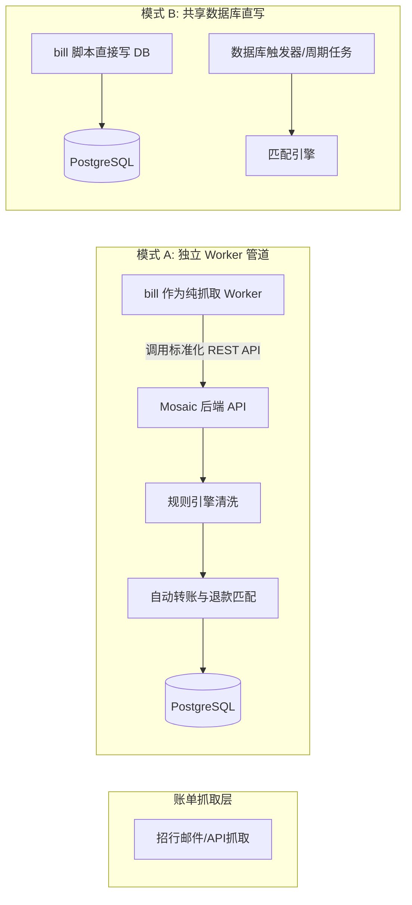

# Mosaic 架构升级深水区问题与决策指引文档

> **说明**：将 Mosaic 前端与后端升级为对标 sure-web（支持多用户、OIDC、家庭共享、自动匹配转账退款）是一个深度的全栈演进工程。在实际落地中，涉及大量**技术栈边界、领域模型设计模式、复杂财务边界逻辑以及家庭权限权衡**。
>
> 本文档专门梳理出需要您**亲自把关、拍板方向的关键决策点（Decision Points）**，请您审阅并给出指点方向。

---

## 目录

- [决策一：前后端技术栈与演进路径选型](#决策一前后端技术栈与演进路径选型)
- [决策二：核心记账领域模型与设计模式](#决策二核心记账领域模型与设计模式)
- [决策三：自动匹配转账与退款的业务边界与深水区](#决策三自动匹配转账与退款的业务边界与深水区)
- [决策四：家庭共享与多用户权限隔离策略](#决策四家庭共享与多用户权限隔离策略)
- [决策五：OIDC / SSO 单点登录与用户生命周期](#决策五oidc--sso-单点登录与用户生命周期)
- [决策六：招行邮件账单自动化（sure/bill）的集成模式](#决策六招行邮件账单自动化的集成模式)
- [决策七：规则引擎（Rules Engine）的触发架构](#决策七规则引擎rules-engine的触发架构)
- [用户指点反馈清单（决策速查表）](#用户指点反馈清单决策速查表)

---

## 决策一：前后端技术栈与演进路径选型

这是整个重构最根本的方向抉择。

### 现状背景
- **Mosaic**：前端是 React 18 + Vite (SPA)，后端是 Python 3.11 + FastAPI。
- **sure-web**：前端是 Rails 8 + ViewComponent + Hotwire (Turbo/Stimulus)，后端是 Ruby on Rails 8。
- **sure/bill**：独立的招行账单 Python 自动化抓取脚本与 FastAPI 仪表盘。

### 方案对比

| 选项 | 实施策略 | 优势 | 挑战与代价 |
| :--- | :--- | :--- | :--- |
| **方案 1A：全栈 Python + React 重构**<br>*(推荐方案)* | 保持 Mosaic 的 **FastAPI + React 18**。<br>在 React 中用 Tailwind 1:1 复刻 sure-web 设计系统与交互。<br>在 FastAPI 中按 sure-web 数据结构重写后端。 | 1. 维持现代前后端分离与 SPA 极致流畅度；<br>2. 深度契合现有 Python 账单分析和自动化生态；<br>3. 代码完全自主可控。 | 相当于用 Python/FastAPI 把 sure 的 30+ 张表和 API 重新开发一遍，前端也需重写一套完整的 React DS 组件库。 |
| **方案 1B：直接以 sure-web 为核心，Mosaic 融入 sure** | 放弃 Mosaic 前后端，直接基于本地现成的 `sure-web` 进行二次开发。<br>将 Mosaic 的招行账单抓取、Sankey 图表以插件或 API 形式接入 sure-web。 | 1. **零成本获得全部功能**（多用户、OIDC、家庭共享、转账退款匹配已在 sure-web 跑通）；<br>2. 前端界面天生就是 sure-web，无需任何复刻；<br>3. 周期最短，最快可用。 | 需维护 Ruby on Rails 8 + Hotwire 资产，若团队不熟悉 Ruby 栈，后续二次开发有技术门槛。 |
| **方案 1C：Next.js / Remix 全栈 SSR 重构** | 采用 Next.js (React) 重建前端与 BFF，后端依然对接 FastAPI。 | 既有 React 生态，又有类似 Rails 的服务端渲染能力。 | 引入额外的一层 Node.js 运行时，架构变重。 |

> ❓ **需要您的指点**：
> 您倾向于 **方案 1A**（继续用 FastAPI + React，彻底重写出一套 Python 版的 Sure），还是 **方案 1B**（直接以本地已有的 sure-web 为基底，将 Mosaic 的特色并入 sure-web）？

---

## 决策二：核心记账领域模型与设计模式

记账系统底层有两大流派，直接决定未来数据的扩展性。

### 方案 2A：复式记账模式（Double-Entry Bookkeeping）
- **模式说明**：采用经典会计学模式（如 Beancount / Ledger / Firefly III）。每一笔交易必须包含至少两个分支（Split）：一个账户借记（Debit），另一个账户贷记（Credit），借贷必须绝对平衡。
- **优点**：转账天然成立（从银行卡借记，到支付宝贷记），不存在收支重复统计；数学上无懈可击。
- **缺点**：普通用户理解门槛极高，开发界面和录入极其繁琐（哪怕买瓶水也要理解两个科目）。

### 方案 2B：账户条目 + 双向关联模式（Single-Entry with Transfer Linkage）—— *sure-web 所用模式*
- **模式说明**：每个账户有独立的流水（Entry / Transaction）。当发生转账时，系统建立一条独立关联记录 `Transfer`，将账户 A 的流出流水与账户 B 的流入流水配对。在计算收支报表时，只要标注为 Transfer 的记录自动排除。
- **优点**：符合普通大众的单式直觉，对账简单，导入银行流水极为自然。
- **缺点**：当发生“一对多转账”（例如一笔取款 1000 元，其中 600 存 A 账户，400 存 B 账户）或跨币种汇率波动时，配对逻辑需要支持拆分（Split）。

> ❓ **需要您的指点**：
> 我们是否完全沿用 sure-web 的 **方案 2B（账户条目 + Transfer 双向绑定模式）**？

---

## 决策三：自动匹配转账与退款的业务边界与深水区

这是本次改造最核心的算法与交互逻辑，涉及一些复杂的现实财务边界：

### 1. 跨期退款（Cross-period Refunds）的处理方式
- **典型场景**：1月20日信用卡买了一台手机 6000 元（1月份支出报表体现为 6000 元）。2月5日发生退货退款 6000 元。
- **争议点**：
  - **策略 A（历史追溯冲抵）**：将 2 月退款反向冲抵 1 月的原始支出。
    - *结果*：1 月支出变为 0，2 月支出不受影响。
    - *问题*：用户 1 月份的月度总结报表会在 2 月份被“篡改”，导致历史账目动态变动。
  - **策略 B（当期负向平抑）**：退款只冲抵当月的支出总额（当月产生一笔 -6000 的负向支出）。
    - *结果*：1 月支出仍为 6000，2 月若总消费只有 3000，则 2 月总支出会变成负数（-3000）。
  - **策略 C（折中方案）**：在关联关系中记录 `refund_of_transaction_id`，但在报表展示时提供切换开关：“按消费发生日追溯统计” vs “按现金实际流入流出日统计”。

> ❓ **需要您的指点**：您更倾向于哪种退款统计原则？（推荐策略 A 或 策略 C）

### 2. 跨账户退款（Cross-account Refunds）
- **典型场景**：使用招行信用卡付款，在实体店退货时，商家直接通过微信或现金将退款退到了另一个账户。
- **问题**：系统是否允许将【账户 B 的入账退款】去冲抵【账户 A 的历史消费】？
  - *选项 1*：允许（只要同属一个家庭，允许跨账户冲抵原消费）。
  - *选项 2*：限制只能在同一账户内冲抵，跨账户的必须先做内部转账。

> ❓ **需要您的指点**：是否开放跨账户退款冲抵？

### 3. 转账自动匹配的“容差与确认边界”
- **典型场景**：
  - 自动确认（Auto-commit）：当系统发现日期相差 $\le 2$ 天，金额完全相同，账户不同的一出一进，系统是**直接静默自动合并为转账**，还是**必须放在待办箱中由人工点击确认**？
  - 汇率容差：跨币种转账（如从人民币账户转 7200 元换成 1000 美元存入美金账户），是否允许设置容差匹配？

> ❓ **需要您的指点**：
> 是否采用 **“高置信度（同币种同金额±2天）静默自动匹配，边缘置信度放入待办人工确认”** 的混合机制？

---

## 决策四：家庭共享与多用户权限隔离策略

在家庭实际日常使用中，不同家庭对“隐私”和“共享”的要求截然不同：

### 1. 资产与流水的可见性模型
- **模式 A：大一统家庭大盘（全公开模式）**
  - 所有家庭成员无条件看到家庭内所有的账户和所有的流水。适合关系极其紧密的夫妻共同记账。
- **模式 B：细粒度账户授权（sure-web 模式）**
  - 账户有独立的拥有者（Owner）。拥有者可以选择将该账户分享给其他家庭成员，并设置权限：
    - `Read-Only`：只能看余额和流水；
    - `Read-Write`：可以查看并在此账户下记账；
    - `Full-Control`：可修改账户名称、参数或删除。
  - 若不公开，则为纯私有账户，家庭大盘也不计入该账户。
- **模式 C：支出公开、资产脱敏（混合模式）**
  - 家庭成员可以看到共同支出流水（如房贷、买菜、水电），但**看不到对方账户的实际余额与理财总身家**。

> ❓ **需要您的指点**：
> 您的家庭记账场景更倾向于 **模式 A（全透明）**，还是 **模式 B（细粒度授权）**，或是 **模式 C（流水公开、余额脱敏）**？

### 2. 多家庭组织（Multi-Family）支持度
- Mosaic 是否需要支持一个用户同时加入多个家庭（如“我和老婆的家庭”与“我和父母的家庭”并支持随时切换），还是系统全局定位为**单家庭多成员**即可？

---

## 决策五：OIDC / SSO 单点登录与用户生命周期

### 1. 外部用户首次登录时的行为模式（JIT Provisioning）
当系统接入了 OIDC（如公司内部 Keycloak、Authentik、Cloudflare Zero Trust 或 Google）：
- **策略 A：开放式自动建号（JIT）**
  - 只要在 IdP 认证通过，首次登录自动在本地创建用户，并自动加入主家庭（或自动为他创建一个新家庭）。
  - *风险*：若 IdP 是公共的（如 Google 登录），任何拥有 Google 账号的人都能进入系统。
- **策略 B：白名单域限制**
  - 仅允许特定邮箱后缀（如 `@myfamily.com`）或白名单邮箱列表自动建号。
- **策略 C：严格邀请制（Link Only）**
  - OIDC 仅作为现有账号的快捷登录凭证。新用户必须先由家庭管理员在系统内生成邀请码，通过邀请码激活后，才能绑定 OIDC 身份。

> ❓ **需要您的指点**：
> 您打算接入哪个具体的 OIDC 服务商（Authentik / Keycloak / Google 等）？新用户应采用**策略 B（域名白名单）** 还是 **策略 C（邀请制绑定）**？

---

## 决策六：招行邮件账单自动化（sure/bill）的集成模式

目前系统中存在一个非常重要的资产：`~/famwealth/sure/bill`（招行邮件账单自动化抓取）。

### 改造后它的定位如何安排？



- **模式 A（推荐：API 管道模式）**：
  `bill` 仅负责从 Outlook/Graph API 抓取招行邮件、解析出结构化账单，然后通过认证调用 Mosaic 提供的 `POST /api/v1/transactions/import` 接口。
  - *优点*：由 Mosaic 后端统一触发**规则清洗、自动转账匹配、退款识别、实时 WebSocket 通知**，架构解耦且稳健。
- **模式 B（直写数据库模式）**：
  `bill` 直接写入 PostgreSQL 的 `transactions` 表，然后触发存储过程或外部脚本。
  - *缺点*：绕过了业务层的完整生命周期校验。

> ❓ **需要您的指点**：
> 是否同意采用 **模式 A**，将 `bill` 改造为通过统一 API 与 Mosaic 对接的标准化数据采集器？

---

## 决策七：规则引擎（Rules Engine）的触发架构

规则引擎（如：自动将包含“美团外卖”的流水归类为“餐饮美食”，将“还款”标记为转账）应该采用何种设计模式？

### 设计模式选型
- **模式 1：责任链模式（Chain of Responsibility）**
  - 规则按优先级排成流水线。一笔交易进入后，依次过各个规则。支持“匹配后继续向下执行”或“匹配后终止匹配”。
- **模式 2：规格模式（Specification Pattern）**
  - 条件组合：支持 `AND`、`OR`、`NOT` 的复合嵌套条件（例如：`（商户包含 "京东" 且 金额 > 1000）或 分类为 "电子产品"`）。
- **执行时机**：
  - 同步流水线执行（账单导入时立即跑完）；
  - 支持“回溯执行（Retroactive Run）”：当用户新增或修改一条规则时，弹窗询问“是否对过去所有历史流水执行此规则？”。

> ❓ **需要您的指点**：是否需要支持复杂的 `AND/OR` 嵌套条件，以及历史流水回溯清洗？

---

## 用户指点反馈清单（决策速查表）

您可以直接复制下方内容，在对应选项打勾或写下您的具体要求：

```markdown
### 我的架构指引反馈：

1. **前后端技术栈演进**：
   [ ] 选项 1A：保留 FastAPI + React SPA，全新自研复刻 sure-web
   [ ] 选项 1B：直接基于已有的 sure-web (Rails 8)，将 Mosaic/bill 特性并入 sure-web
   [ ] 您的具体想法：____________________

2. **记账核心模型**：
   [ ] 选项 2A：严格复式记账（Double-Entry）
   [ ] 选项 2B：账户条目 + Transfer 双向绑定模式（对齐 sure-web）

3. **退款与转账匹配策略**：
   - 跨期退款：[ ] 追溯冲抵原账单月份  [ ] 冲抵退款当月支出  [ ] 提供报表切换
   - 跨账户退款冲抵：[ ] 允许  [ ] 禁止（仅限同账户）
   - 转账自动配对：[ ] 高置信度静默自动合并  [ ] 全部需人工确认

4. **家庭共享与资产权限**：
   [ ] 模式 A：家庭内部全透明
   [ ] 模式 B：细粒度授权（账户有所有者，支持只读/读写/私有）
   [ ] 模式 C：流水公开、实时账户余额脱敏

5. **OIDC / SSO 认证规划**：
   - 打算接入的 IdP 是：____________________ (如 Keycloak / Authentik / Google)
   - 新用户建号策略：[ ] 域名白名单自动开户  [ ] 仅限邀请码激活后绑定

6. **招行账单 (sure/bill) 整合**：
   [ ] 模式 A：bill 作为采集器，通过统一 REST API 推送到系统（推荐）
   [ ] 模式 B：bill 直接写 PostgreSQL

7. **规则引擎复杂度**：
   [ ] 简单规则（单条件或全部满足）
   [ ] 复杂规则（支持 AND/OR 嵌套与历史流水回溯）

8. **其他补充说明与特殊要求**：
   _________________________________________________________
```

---

期待您的指点！一旦您确定上述方向，我们将立即按照您选定的技术与业务蓝图展开系统化实施。
