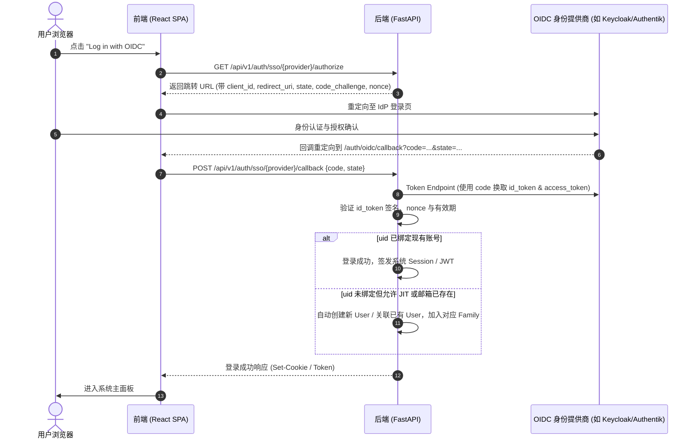
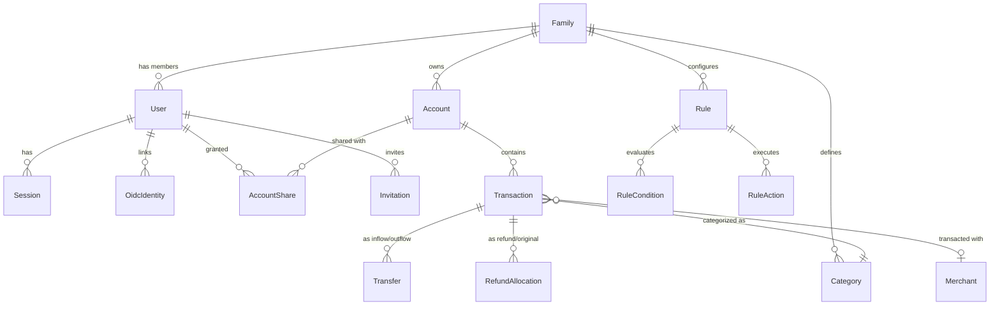

# Mosaic 前端改造与功能升级规范方案（对标 sure-web）

> **目标**：将 **Mosaic** 的网页前端彻底改造为与 **sure-web** 相同的设计语言与交互体验，并在此基础上升级后端，全面支持 sure-web 的核心高级功能，包括：**多用户体系**、**OIDC / SSO 单点登录**、**家庭共享与协作**、**自动匹配转账与退款**，以及**账户资产管理与规则引擎**。

---

## 目录

1. [项目背景与系统现状对比](#1-项目背景与系统现状对比)
2. [总体架构演进与技术路线抉择](#2-总体架构演进与技术路线抉择)
3. [前端改造方案：全面对标 sure-web 设计与交互](#3-前端改造方案全面对标-sure-web-设计与交互)
   - 3.1 [Sure Design System（设计系统与 Tokens）迁移](#31-sure-design-system设计系统与-tokens迁移)
   - 3.2 [通用 UI 组件库重构（React 版 DS 组件）](#32-通用-ui-组件库重构react-版-ds-组件)
   - 3.3 [页面布局与路由体系升级](#33-页面布局与路由体系升级)
   - 3.4 [核心页面改造细节](#34-核心页面改造细节)
4. [核心功能与后端架构深度改造](#4-核心功能与后端架构深度改造)
   - 4.1 [多用户体系（Multi-user System）](#41-多用户体系multi-user-system)
   - 4.2 [OIDC / SSO 单点登录体系](#42-oidc--sso-单点登录体系)
   - 4.3 [家庭共享与多租户协作（Family / Household Sharing）](#43-家庭共享与多租户协作family--household-sharing)
   - 4.4 [自动匹配转账与退款（Auto-matching Transfers & Refunds）](#44-自动匹配转账与退款auto-matching-transfers--refunds)
   - 4.5 [规则引擎（Rules Engine）](#45-规则引擎rules-engine)
5. [数据模型与数据库演进（PostgreSQL 升级）](#5-数据模型与数据库演进postgresql-升级)
6. [API 接口设计规范与全量清单](#6-api-接口设计规范与全量清单)
7. [老数据平滑迁移方案（SQLite 到 PostgreSQL）](#7-老数据平滑迁移方案sqlite-到-postgresql)
8. [分阶段实施路线图与落地计划](#8-分阶段实施路线图与落地计划)

---

## 1. 项目背景与系统现状对比

### 1.1 两个系统的定位与技术栈现状

| 维度 | Mosaic 现状 (`~/famwealth/Mosaic`) | sure-web 现状 (`~/famwealth/sure/sure-web`) |
| :--- | :--- | :--- |
| **应用定位** | 本地优先（Local-First）的双人简易记账器 | 社区维护的全功能个人及家庭财富管理平台（原 Maybe Finance） |
| **前端架构** | React 18 + Vite + Tailwind CSS + Lucide Icons (SPA) | Rails 8 + Hotwire (Turbo + Stimulus) + ViewComponents + Tailwind CSS |
| **后端架构** | Python 3.11 + FastAPI + SQLModel | Ruby 3.3 + Rails 8 + ActiveRecord + Sidekiq |
| **数据库** | SQLite（单文件 `mosaic.db`） | PostgreSQL（支持 UUID、JSONB、GIN/Trigram 索引、并发事务） |
| **用户与租户体系** | **最多 2 个用户**（硬编码校验），扁平表，无家庭概念，`paid_by` 存用户名字符串 | **完整多租户组织**（`Family` + `User` + `Invitation`），无人数上限 |
| **身份认证** | 自定义 Cookie Session + 密保问题重置，无 OIDC | 密码登录、WebAuthn、TOTP 2FA、**OIDC / SSO**（Google/Keycloak/Authentik 等） |
| **资产与账户** | 无真实账户概念，仅有简单的 Expense / Income 流水 | **多账户体系**（储蓄、借记、信用卡、投资、贷款、加密货币、房产等），余额实时追踪 |
| **转账处理** | 无转账概念，流转需记为一收一支，导致支出重复统计 | **Transfer 模型**：自动/手动匹配流入与流出交易，从收支大盘中排除 |
| **退款处理** | 无退款关联概念 | **RefundMatcher 模型**：自动识别负向交易、清洗本土支付前缀、关联原支出冲抵 |
| **规则与自动化** | 仅有简单的相似描述合并建议 | **强大的 Rules Engine**（条件匹配 -> 动作执行：分类、商户、转账标记、打标） |

### 1.2 Mosaic 现有代码中的硬伤分析

1. **用户数量死锁**：
   在 [`backend/auth.py`](file:///home/wln/famwealth/Mosaic/backend/auth.py#L257-L260) 中明确硬编码：
   ```python
   count = get_user_count(session)
   if count >= 2:
       raise HTTPException(status_code=409, detail="Maximum of 2 accounts allowed")
   ```
   必须彻底重构用户管理与注册逻辑，支持任意规模的多用户注册。
2. **数据关联弱类型化**：
   [`backend/models.py`](file:///home/wln/famwealth/Mosaic/backend/models.py#L14-L19) 中注释说明：
   `Expense.paid_by` 直接存储用户的 `display_name` 字符串，而非外键。更改用户名将导致历史数据孤立，这在多用户/家庭共享环境下无法维系。
3. **缺少账户抽象**：
   只有 `Expense` 与 `Income`，缺乏底层资金池（Bank Account / Credit Card / Cash Wallet）的概念，无法支持现代财富软件的转账、对账和资产负债表统计。

---

## 2. 总体架构演进与技术路线抉择

要达成“前端视觉与交互与 sure-web 一模一样，功能全面支持 sure-web（多用户、OIDC、家庭共享、自动匹配转账退款）”，有两种技术实施路线：

### 路线 A：Mosaic 全栈现代化升级重构路线（推荐）
- **前端**：保留 Mosaic 的 **React 18 + Vite** 技术栈，将 sure-web 的 **Sure Design System**、组件库、页面布局、交互逻辑 1:1 移植为现代 React SPA 组件。
- **后端**：继续采用 Mosaic 的 **FastAPI** 架构，将数据库引擎升级为 **PostgreSQL**，将数据模型彻底按 sure-web 规范重构，补齐 OIDC、家庭租户、转账退款匹配引擎和规则引擎。
- **优势**：
  1. 维持前后端解耦（SPA + REST/GraphQL API），响应极快，移动端适配与 PWA 体验极佳；
  2. 保留 Python 生态下强大的数据分析、招行邮件账单自动化流水线（`bill` 项目）与 AI 处理能力；
  3. 代码易维护，避免 Rails 全栈 SSR 的复杂资产编译链。

### 路线 B：直接基于 sure-web（Rails）进行定制融合
- 直接采用现成的 sure-web（包含所有现成功能与界面），在 sure-web 中集成 Mosaic 原有的特性（如招行邮件解析、Sankey 桑基图定制、本地化报表）。
- **局限**：如果团队更熟悉 Python/FastAPI/React，维护 Rails 8 + Hotwire + Sidekiq 的学习与维护成本较高。

> **本文档以【路线 A】为主线展开详尽设计**，同时保障能够平滑对接现有的招行邮件账单自动化模块。

---

## 3. 前端改造方案：全面对标 sure-web 设计与交互

sure-web 的界面具有强烈的现代金融产品美感：极简黑白灰基底、高对比度微渐变、精致内阴影（Inner Shadow）、卡片化视觉容器、响应式侧边栏折叠。

### 3.1 Sure Design System（设计系统与 Tokens）迁移

在 Mosaic 前端 [`frontend/tailwind.config.js`](file:///home/wln/famwealth/Mosaic/frontend/tailwind.config.js) 和 CSS 中引入 sure-web 的完整 Design Tokens：

#### 1. 字体配置
- **无衬线字体**：Geist / Inter，系统回退：`-apple-system, BlinkMacSystemFont, "Segoe UI", Roboto`。
- **等宽字体**：Geist Mono / SFMono-Regular，用于金额、时间与代码显示。

#### 2. 色彩与语义变量（移植自 `sure-web/app/assets/tailwind/sure-design-system/_generated.css`）
```css
:root {
  --color-surface: #FAFAFA;            /* 主背景底色 (Light) */
  --color-surface-hover: #F0F0F0;
  --color-container: #FFFFFF;          /* 卡片与容器背景 */
  --color-container-hover: #F7F7F7;
  --color-border: #E7E7E7;            /* 分割线与微边框 */
  --color-border-subtle: #F0F0F0;
  --color-text-primary: #0B0B0B;       /* 主标题与重点文字 */
  --color-text-secondary: #5C5C5C;     /* 正文与副标题 */
  --color-text-muted: #9E9E9E;         /* 占位符与辅助说明 */
  
  --color-positive: #16A34A;          /* 资产增加、收入、正向收益 */
  --color-destructive: #EF4444;       /* 支出、负债、危险操作 */
  --color-warning: #D97706;           /* 待审核、待匹配提示 */
  --color-info: #2563EB;              /* 链接、辅助提示 */
}

.dark {
  --color-surface: #0B0B0B;            /* 主背景底色 (Dark) */
  --color-surface-hover: #171717;
  --color-container: #171717;          /* 卡片与容器背景 */
  --color-container-hover: #242424;
  --color-border: #2E2E2E;
  --color-border-subtle: #242424;
  --color-text-primary: #FFFFFF;
  --color-text-secondary: #A3A3A3;
  --color-text-muted: #737373;
}
```

#### 3. 边框投影系统（Sure Shadow System）
sure-web 大量使用基于 box-shadow 的极细边框（border-ring 效果）：
- `shadow-border-xs`: `0 0 0 1px rgba(0, 0, 0, 0.08)`（Dark 模式下采用 `rgba(255, 255, 255, 0.08)`）
- `shadow-card`: `0 1px 3px 0 rgba(0, 0, 0, 0.05), 0 0 0 1px rgba(0, 0, 0, 0.06)`

---

### 3.2 通用 UI 组件库重构（React 版 DS 组件）

在 Mosaic `frontend/src/components/ds/` 目录下建立对标 sure-web `app/components/DS/` 的基础组件：

```
frontend/src/components/ds/
├── Button.jsx            # 支持 variant (primary, secondary, destructive, ghost), size (sm, md, lg)
├── Card.jsx              # 支持 standard, interactive, inset, borderless
├── Dialog.jsx            # 模态弹窗（基于 Headless UI 或 Radix UI Dialog）
├── SlideOver.jsx         # 侧边滑出抽屉（用于交易详情与编辑）
├── Popover.jsx           # 浮动气泡（操作菜单、筛选条件面板）
├── Menu.jsx              # 下拉操作菜单
├── Pill.jsx              # 状态标签（标准、转账、退款、已忽略、分类）
├── SegmentedControl.jsx  # 分段选择器（时间跨度: 30天/本月/今年/全部；视图切换: 全部/个人）
├── Select.jsx            # 下拉选择框（支持搜索、图标、空状态）
├── CategorySelect.jsx    # 树状分类选择器，支持分类颜色与图标
├── MerchantSelect.jsx    # 商户自动联想与商户图标选择器
├── AccountPicker.jsx     # 账户下拉选择（按资产/负债分类分组显示）
├── Tooltip.jsx           # 悬浮说明气泡
└── ProgressRing.jsx      # 圆环进度指示器（预算执行进度）
```

---

### 3.3 页面布局与路由体系升级

sure-web 采用典型的三栏/双栏现代后台布局。Mosaic 原有的单页顶部导航（`Navbar.jsx`）需彻底替换为 **侧边栏导航 + 主工作区 + 详情抽屉** 模式。

#### 1. 整体布局组件 (`frontend/src/layouts/AppLayout.jsx`)
- **左侧边栏（Sidebar）**：
  - **顶部组织选择器**：显示当前家庭名称（如 "Family"）、切换家庭、邀请成员入口。
  - **核心导航菜单**：
    - 📊 **Dashboard** (`/`)：净资产大盘、月度收支、快速概览。
    - 💳 **Accounts** (`/accounts`)：银行、信用卡、投资账户分组列表，带有微型走势图（Sparklines）与实时余额。
    - 📝 **Transactions** (`/transactions`)：全量流水明细，支持高级多维筛选。
    - 🔁 **Recurring & Subscriptions** (`/recurring`)：周期性账单与订阅追踪。
    - ⚡ **Rules & Automations** (`/rules`)：规则配置、转账匹配候选审阅、退款冲抵候选审阅。
    - 📈 **Reports & Analytics** (`/reports`)：收支趋势、分类占比、桑基图分析。
    - ⚙️ **Settings** (`/settings`)：个人偏好、安全设置、家庭成员与共享权限、SSO 配置。
  - **折叠与隐私模式开关**：
    - 一键切换 Privacy Mode（模糊化隐藏所有敏感资产数字）。
    - 深色/浅色模式切换器。
  - **底部用户信息卡片**：当前登录人头像、邮箱、角色标签、退出登录。

#### 2. 页面路由重组表 (`frontend/src/App.jsx`)
```jsx
<Routes>
  {/* 公开与认证路由 */}
  <Route path="/login" element={<Login />} />
  <Route path="/signup" element={<SignUp />} />
  <Route path="/invite/:code" element={<AcceptInvite />} />
  <Route path="/auth/oidc/callback" element={<OidcCallback />} />
  
  {/* 受保护的主业务路由（嵌套于 AppLayout 中） */}
  <Route element={<RequireAuth><AppLayout /></RequireAuth>}>
    <Route path="/" element={<Dashboard />} />
    <Route path="/accounts" element={<AccountsPage />} />
    <Route path="/accounts/:accountId" element={<AccountDetailPage />} />
    <Route path="/transactions" element={<TransactionsPage />} />
    <Route path="/transfers/matches" element={<TransferMatchesPage />} />
    <Route path="/rules" element={<RulesPage />} />
    <Route path="/reports" element={<ReportsPage />} />
    <Route path="/recurring" element={<RecurringPage />} />
    <Route path="/settings/*" element={<SettingsPage />} />
  </Route>
</Routes>
```

---

### 3.4 核心页面改造细节

#### 1. 仪表盘 (Dashboard)
- **Net Worth 卡片**：大字号展示当前家庭总净资产，支持按 30天 / 90天 / 1年 / 全部 切换历史净值面积图。
- **Cash Flow 概览**：本月总流入（Income）、总流出（Expenses）、净储蓄（Net Savings）及环比上月浮动百分比。
- **待处理任务卡片 (Action Required Cards)**：
  - “发现 3 笔疑似内部转账，点击快速匹配”
  - “发现 2 笔退款尚未关联原支出，点击关联”
  - “发现 5 笔未分类交易”
- **资产与负债结构条形图/环形图**。

#### 2. 交易列表页 (Transactions Page)
对标 sure-web 的交易流水界面：
- **组合筛选工具栏**：
  - 账户筛选（多选）、时间跨度（Period Picker）、分类多选、商户搜索、标签筛选、成员筛选（全部/爸爸/妈妈）。
  - **交易类型过滤**：`全部` / `常规收支` / `账户转账` / `退款冲抵` / `已排除`。
- **交易列表交互**：
  - 勾选多笔交易进行批量操作（批量分类、批量标记转账、批量删除、批量打标签）。
  - 单击交易行在右侧弹出 **Transaction Drawer（滑动抽屉）**：
    - 展示交易原始名称、清洗后的商户、关联账户、发生日期、金额。
    - **转账状态徽章**：若已匹配转账，显示“转入至 [招行储蓄卡]”，并提供“解绑转账”按钮。
    - **退款冲抵面板**：若是退款交易，展示“关联的原消费支出”列表，支持查看原消费剩余可冲抵额度，支持手动搜索原消费完成绑定。
    - **智能规则生成入口**：点击“基于此交易创建规则”，自动预填条件（商户/金额）。

#### 3. 自动化与转账退款匹配中心 (`/rules` & `/transfers/matches`)
- **转账候选确认流（Transfer Match Candidates）**：
  - 卡片式并排展示出账交易与入账交易（日期、账户、金额），中间带有关联双箭头图标。
  - 操作按钮：`确认配对 (Confirm Transfer)`、`驳回/非转账 (Reject)`、`拆分对齐 (Split to Match)`。
- **退款候选确认流（Refund Candidates）**：
  - 展示退款条目（绿色/负支出）与高置信度的原支出条目（商户相似度、时间间隔、金额完全匹配标识）。
  - 提供“一键冲抵”与“手动搜索其他支出”。
- **规则配置列表（Rules List）**：
  - 可视化条件构建器：`当 [商户] [包含] "星巴克" 且 [金额] [大于] 0`。
  - 可视化动作执行器：`执行 -> [设置分类: 餐饮美食] 且 [添加标签: 咖啡]`。

---

## 4. 核心功能与后端架构深度改造

为了完全支撑前端对标 sure-web 的四大高级能力，Mosaic 后端必须进行全面的业务与数据架构演进。

### 4.1 多用户体系（Multi-user System）

#### 业务逻辑设计
1. **解除用户注册上限**：
   - 彻底删除 `get_user_count(session) >= 2` 阻断逻辑。
   - 引入系统初次部署时的 **Setup Wizard（初始化向导）**：创建系统首位超级管理员账户及首个家庭组织。
   - 后续注册模式支持：`公开注册`、`仅邀请码注册 (Invite Code)`、`仅管理员后台创建`、`SSO 自动建号 (JIT Provisioning)`。
2. **多设备会话管理 (Session Management)**：
   - 废除原有的单一 `session_version` 模式。
   - 新增 `Session` 表，记录 `user_id`, `token_hash`, `ip_address`, `user_agent`, `last_active_at`, `expires_at`。
   - 支持用户在“安全设置”中查看当前所有登录设备列表，并支持一键“踢出其他设备”。

---

### 4.2 OIDC / SSO 单点登录体系

对标 sure-web 的 `sso_providers` 和 `oidc_identities` 模块。

#### 1. 数据模型设计
- **`sso_providers` 表**：
  - `id` (UUID): 唯一标识。
  - `name`: 唯一别名（如 `authentik`, `keycloak`, `google`, `custom-oidc`）。
  - `label`: 界面显示名称（如 "Sign in with Keycloak"）。
  - `issuer`: OIDC 发行者地址（用于通过 `/.well-known/openid-configuration` 自动发现 endpoints）。
  - `client_id`, `client_secret` (加密存储)。
  - `redirect_uri`: 回调地址。
  - `enabled`: 是否启用。
  - `settings`: JSONB，存储自定义 scopes、是否自动建号（JIT）、受信任邮箱后缀列表（如 `@myfamily.com`）。
- **`oidc_identities` 表**：
  - `id` (UUID).
  - `user_id` (UUID 外键 -> users.id).
  - `provider` (string): 对应 sso_providers.name.
  - `uid` (string): IdP 返回的唯一 `sub` 标识符（组合唯一索引 `[provider, uid]`）。
  - `issuer`: 发行方标识。
  - `info`: JSONB 存储用户原始 profile (email, name, picture 等)。
  - `last_authenticated_at`: 上次单点登录时间。

#### 2. 认证执行流程（Authlib / FastAPI）


---

### 4.3 家庭共享与多租户协作（Family / Household Sharing）

在 sure-web 中，所有核心资产与交易不是直接挂在单个 User 下，而是挂在 **`Family`（家庭）** 下。家庭成员既能查看家庭大盘，又能保持账户维度的私密性。

#### 1. 核心架构设计
- **`Family` 实体**：
  - 核心属性：家庭名称（如 "张三一家"）、本位币（`currency`，如 `CNY`）、记账周期起止日（`month_start_day`，默认 1 号）、默认账户共享模式（`default_account_sharing`: `shared` 或 `private`）。
- **`FamilyMember` 关联关系**：
  - 成员角色（Role）：
    - `owner`（户主/超级管理员）：管理家庭设置、成员邀请、计费与全部数据。
    - `admin`（管理员）：可管理账户、规则、邀请成员。
    - `member`（普通家庭成员）：可记录交易、查看共享账户。
    - `guest`（受限成员/只读）：仅可查看允许其查看的数据。
- **`AccountShare`（细粒度账户共享控制）**：
  - 每个账户（如招行储蓄卡、支付宝余额宝）由一名特定用户拥有（`owner_id`）。
  - 拥有者可通过 `account_shares` 授予其他家庭成员不同权限：
    - `full_control`：可编辑账户设置、导入账单、编辑所有流水。
    - `read_write`：可查看并在此账户下录入/编辑交易。
    - `read_only`：仅可查看余额与交易流水。
  - `include_in_finances` 开关：允许成员自主选择是否将家庭其他人的某个共享账户计入自己的“个人净资产走势”。
- **多维度视图切换（View Scopes）**：
  - **家庭总览模式 (Household Scope)**：聚合全家所有标记为共享的账户与支出，生成家庭收支大盘与资产负债表。
  - **个人专属模式 (Personal Scope)**：仅显示当前用户个人的私有账户及名下支出。

---

### 4.4 自动匹配转账与退款（Auto-matching Transfers & Refunds）

这是 sure-web 最具技术含量且极其实用的两大功能。原 Mosaic 将所有资金流动硬编码为“支出”或“收入”，导致信用卡还款、账户互转、网购退款引起收支统计严重失真。

#### 1. 自动转账匹配引擎 (Auto Transfer Matcher)
参考 sure-web 的 `Family::AutoTransferMatchable` 算法：

##### A. 转账候选检测算法
- **时间窗口（Date Window）**：出账与入账交易发生在 $\pm 4$ 天内。
- **金额对齐（Amount Alignment）**：出账金额绝对值等于入账金额（跨币种时在容差 `exchange_rate_tolerance: 0.1` 范围内）。
- **账户异构性**：出账账户与入账账户必须为不同的两个账户（属于同一家庭）。
- **排除已匹配项**：排除已经关联为 `Transfer` 或被用户主动驳回（`rejected_transfers`）的记录。

##### B. 数据结构与状态变更
- **`transfers` 表**：
  - `id` (UUID).
  - `outflow_transaction_id` (UUID 外键 -> 资金转出方交易).
  - `inflow_transaction_id` (UUID 外键 -> 资金转入方交易).
  - `amount`: 转账金额。
  - `status`: `confirmed` (已确认) / `pending` (待审核).
- **类型重塑**：
  - 一旦匹配为转账，转入交易的 `kind` 置为 `funds_movement`，转出交易置为 `transfer`（或 `investment_contribution`）。
  - **核心计算逻辑**：报表统计时，`kind in ('funds_movement', 'transfer')` 的交易**不计入支出也不计入收入**，仅作为资产间的转移，完美避免虚增开支。

---

#### 2. 智能退款冲抵引擎 (Refund Matcher)
参考 sure-web 中针对中国支付场景特别优化的 `RefundMatcher` 实现：

##### A. 退款特征识别
- 交易金额为正（或分类为退款/撤销流水）。
- 交易摘要中包含退款关键词：`退款`、`退货`、`消费撤销`、`撤销`、`返还`、`退回`。

##### B. 本土化商户名称清洗与相似度匹配
针对微信、支付宝、网银等流水前缀进行预处理剥离：
```python
PAYMENT_PREFIXES = [
    "支付宝", "财付通", "微信支付", "银联", "云闪付", 
    "京东支付", "美团支付", "抖音支付", "网银在线"
]
```
- **算法流程**：
  1. 剥离上述前缀后提取核心商户名（如从 `微信支付-星巴克（中关村店）` 提取 `星巴克（中关村店）`）。
  2. 检索时间窗口：查找发生在退款日期之前（$\le \text{refund\_date}$）的同一家庭标准支出（`kind = 'standard'`）。
  3. 计算商户文本相似度（Jaro-Winkler 或 Levenshtein 归一化得分）。
  4. 校验原支出可冲抵余额：$\text{remaining\_refundable\_amount} \ge \text{refund\_amount}$。
  5. 自动匹配阈值：当且仅当**金额完全一致且商户相似度 $\ge 0.88$** 时触发自动关联；其余候选列入“建议匹配”供人工一键确认。

##### C. 退款拆分与部分冲抵模型 (`refund_allocations`)
- 一笔退款可能对应一整笔消费，也可能是一笔大订单中的部分退款。
- **`refund_allocations` 表**：
  - `id` (UUID).
  - `refund_transaction_id` (UUID -> 退款流水).
  - `original_transaction_id` (UUID -> 原消费流水).
  - `amount`: 冲抵金额。
- **效果**：原消费交易净额更新为 `amount - refunded_amount`，在月度支出报表中只体现实际消费的净支出，防止退款被误计为当月收入。

---

### 4.5 规则引擎（Rules Engine）

支持用户像配置防火墙规则一样自动化清洗流水。

#### 1. 模型设计 (`rules`, `rule_conditions`, `rule_actions`)
- **条件类型 (`condition_type`)**：
  - `merchant`: 商户名称（等于/包含/正则）。
  - `name`: 交易原始描述。
  - `amount`: 交易金额（大于/小于/等于/区间）。
  - `account`: 所属账户。
  - `notes`: 备注。
- **执行动作 (`action_type`)**：
  - `set_category`: 设定分类。
  - `set_merchant`: 规范化商户名称。
  - `set_as_transfer`: 设为转账。
  - `add_tag`: 添加标签。
  - `exclude_from_reports`: 排除在报表之外。
- **执行时机**：
  - 招行邮件账单或 CSV 导入时自动流水线触发。
  - 用户随时在规则管理界面点击“对历史交易重新运行此规则”。

---

## 5. 数据模型与数据库演进（PostgreSQL 升级）

Mosaic 目前使用 SQLite，但为了支持 UUID 主键、高并发事务处理、复杂的转账退款匹配 SQL 查询（窗口函数、CTE），**强烈推荐全面升级至 PostgreSQL 16+**。

### 核心数据库表结构（ER 设计）



### PostgreSQL 关键表 DDL 示例

```sql
-- 启用 UUID 扩展
CREATE EXTENSION IF NOT EXISTS "pgcrypto";

-- 1. 家庭租户表
CREATE TABLE families (
    id UUID PRIMARY KEY DEFAULT gen_random_uuid(),
    name VARCHAR(100) NOT NULL,
    currency VARCHAR(10) DEFAULT 'CNY' NOT NULL,
    date_format VARCHAR(20) DEFAULT 'YYYY-MM-DD' NOT NULL,
    month_start_day INT DEFAULT 1 CHECK (month_start_day BETWEEN 1 AND 28),
    default_account_sharing VARCHAR(20) DEFAULT 'shared' CHECK (default_account_sharing IN ('shared', 'private')),
    created_at TIMESTAMPTZ DEFAULT CURRENT_TIMESTAMP NOT NULL,
    updated_at TIMESTAMPTZ DEFAULT CURRENT_TIMESTAMP NOT NULL
);

-- 2. 用户表
CREATE TABLE users (
    id UUID PRIMARY KEY DEFAULT gen_random_uuid(),
    family_id UUID NOT NULL REFERENCES families(id) ON DELETE CASCADE,
    email VARCHAR(255) UNIQUE,
    username VARCHAR(100) UNIQUE NOT NULL,
    display_name VARCHAR(100) NOT NULL,
    password_hash VARCHAR(255),
    role VARCHAR(20) DEFAULT 'member' CHECK (role IN ('owner', 'admin', 'member', 'guest')),
    theme VARCHAR(20) DEFAULT 'system',
    is_active BOOLEAN DEFAULT TRUE NOT NULL,
    created_at TIMESTAMPTZ DEFAULT CURRENT_TIMESTAMP NOT NULL,
    updated_at TIMESTAMPTZ DEFAULT CURRENT_TIMESTAMP NOT NULL
);

-- 3. OIDC 绑定表
CREATE TABLE oidc_identities (
    id UUID PRIMARY KEY DEFAULT gen_random_uuid(),
    user_id UUID NOT NULL REFERENCES users(id) ON DELETE CASCADE,
    provider VARCHAR(50) NOT NULL,
    uid VARCHAR(255) NOT NULL,
    issuer VARCHAR(255),
    info JSONB DEFAULT '{}'::jsonb NOT NULL,
    last_authenticated_at TIMESTAMPTZ,
    created_at TIMESTAMPTZ DEFAULT CURRENT_TIMESTAMP NOT NULL,
    CONSTRAINT uq_oidc_provider_uid UNIQUE (provider, uid)
);

-- 4. 账户表
CREATE TABLE accounts (
    id UUID PRIMARY KEY DEFAULT gen_random_uuid(),
    family_id UUID NOT NULL REFERENCES families(id) ON DELETE CASCADE,
    owner_id UUID REFERENCES users(id) ON DELETE SET NULL,
    name VARCHAR(100) NOT NULL,
    classification VARCHAR(20) NOT NULL CHECK (classification IN ('asset', 'liability')),
    account_type VARCHAR(50) NOT NULL, -- checking, savings, credit_card, investment, loan, other
    currency VARCHAR(10) DEFAULT 'CNY' NOT NULL,
    balance NUMERIC(19, 4) DEFAULT 0.0000 NOT NULL,
    exclude_from_reports BOOLEAN DEFAULT FALSE NOT NULL,
    created_at TIMESTAMPTZ DEFAULT CURRENT_TIMESTAMP NOT NULL,
    updated_at TIMESTAMPTZ DEFAULT CURRENT_TIMESTAMP NOT NULL
);

-- 5. 交易流水表
CREATE TABLE transactions (
    id UUID PRIMARY KEY DEFAULT gen_random_uuid(),
    account_id UUID NOT NULL REFERENCES accounts(id) ON DELETE CASCADE,
    created_by_user_id UUID REFERENCES users(id) ON DELETE SET NULL,
    category_id UUID,
    merchant_id UUID,
    amount NUMERIC(19, 4) NOT NULL, -- 支出为负/入账为正，或统一以规范化为准
    currency VARCHAR(10) NOT NULL,
    transacted_at DATE NOT NULL,
    name VARCHAR(255) NOT NULL,
    notes TEXT,
    kind VARCHAR(30) DEFAULT 'standard' NOT NULL CHECK (kind IN ('standard', 'transfer', 'funds_movement', 'refund')),
    excluded BOOLEAN DEFAULT FALSE NOT NULL,
    extra JSONB DEFAULT '{}'::jsonb NOT NULL,
    created_at TIMESTAMPTZ DEFAULT CURRENT_TIMESTAMP NOT NULL,
    updated_at TIMESTAMPTZ DEFAULT CURRENT_TIMESTAMP NOT NULL
);

-- 6. 转账配对表
CREATE TABLE transfers (
    id UUID PRIMARY KEY DEFAULT gen_random_uuid(),
    family_id UUID NOT NULL REFERENCES families(id) ON DELETE CASCADE,
    outflow_transaction_id UUID NOT NULL UNIQUE REFERENCES transactions(id) ON DELETE CASCADE,
    inflow_transaction_id UUID NOT NULL UNIQUE REFERENCES transactions(id) ON DELETE CASCADE,
    amount NUMERIC(19, 4) NOT NULL CHECK (amount >= 0),
    status VARCHAR(20) DEFAULT 'confirmed' NOT NULL CHECK (status IN ('pending', 'confirmed')),
    created_at TIMESTAMPTZ DEFAULT CURRENT_TIMESTAMP NOT NULL
);

-- 7. 退款冲抵关联表
CREATE TABLE refund_allocations (
    id UUID PRIMARY KEY DEFAULT gen_random_uuid(),
    refund_transaction_id UUID NOT NULL REFERENCES transactions(id) ON DELETE CASCADE,
    original_transaction_id UUID NOT NULL REFERENCES transactions(id) ON DELETE CASCADE,
    amount NUMERIC(19, 4) NOT NULL CHECK (amount > 0),
    created_at TIMESTAMPTZ DEFAULT CURRENT_TIMESTAMP NOT NULL,
    CONSTRAINT uq_refund_pair UNIQUE (refund_transaction_id, original_transaction_id)
);
```

---

## 6. API 接口设计规范与全量清单

升级后的 FastAPI 后端统一采用 RESTful 规范，接口路径以 `/api/v1` 为前缀：

### 6.1 认证与 SSO (Auth & SSO)
- `POST /api/v1/auth/login`：账号密码登录。
- `POST /api/v1/auth/logout`：注销当前会话。
- `GET /api/v1/auth/me`：获取当前登录用户信息、权限及当前家庭信息。
- `GET /api/v1/auth/sso/providers`：获取系统当前启用的 SSO 提供商列表（前端渲染登录按钮）。
- `GET /api/v1/auth/sso/{provider}/authorize`：获取 OIDC 重定向认证 URL。
- `POST /api/v1/auth/sso/{provider}/callback`：处理 OIDC 回调，换取 Token 并建立会话。

### 6.2 家庭与共享 (Family & Members)
- `GET /api/v1/family`：获取当前家庭详情与全局偏好配置。
- `PUT /api/v1/family`：修改家庭设置（货币、记账周期起始日、共享策略）。
- `GET /api/v1/family/members`：获取家庭成员列表与角色。
- `POST /api/v1/family/invitations`：发起成员邀请（生成邀请码或邮件）。
- `POST /api/v1/family/invitations/{token}/accept`：接受邀请并加入家庭。
- `PUT /api/v1/family/members/{user_id}/role`：调整成员角色权限。

### 6.3 账户与资产 (Accounts)
- `GET /api/v1/accounts`：获取家庭账户列表（支持过滤个人/全部，含余额和 Sparklines）。
- `POST /api/v1/accounts`：新建账户（储蓄卡、信用卡、投资账户等）。
- `GET /api/v1/accounts/{id}`：账户详情与关联统计。
- `PUT /api/v1/accounts/{id}`：更新账户信息。
- `PUT /api/v1/accounts/{id}/shares`：配置该账户对其他家庭成员的共享权限（read_only / read_write / full_control）。

### 6.4 交易流水 (Transactions)
- `GET /api/v1/transactions`：交易列表分页检索（支持复杂组合筛选：账户、分类、商户、时间段、kind、成员）。
- `POST /api/v1/transactions`：手动新增单笔交易。
- `PUT /api/v1/transactions/{id}`：编辑交易属性。
- `POST /api/v1/transactions/batch`：批量操作（批量分类、批量排除、批量删除）。

### 6.5 智能转账与退款匹配 (Transfers & Refunds)
- `GET /api/v1/transfers/candidates`：获取系统自动检测出的疑似转账候选对列表。
- `POST /api/v1/transfers/match`：确认匹配两个交易为内部转账。
- `DELETE /api/v1/transfers/{id}`：解除转账绑定，恢复为独立流水。
- `POST /api/v1/transfers/reject`：驳回候选对，防止再次推荐。
- `GET /api/v1/refunds/{transaction_id}/candidates`：为指定退款交易检索高相似度的原消费候选。
- `POST /api/v1/refunds/allocate`：建立退款与原消费的冲抵关联。
- `DELETE /api/v1/refunds/allocations/{id}`：取消退款冲抵关联。

### 6.6 规则引擎 (Rules)
- `GET /api/v1/rules`：获取当前家庭的所有清洗规则。
- `POST /api/v1/rules`：创建新规则（条件集合 + 动作集合）。
- `PUT /api/v1/rules/{id}`：修改规则。
- `DELETE /api/v1/rules/{id}`：删除规则。
- `POST /api/v1/rules/{id}/run-retroactive`：在历史存量交易上回溯执行此规则。

---

## 7. 老数据平滑迁移方案（SQLite 到 PostgreSQL）

针对当前已经在运行的 Mosaic SQLite 数据库（`mosaic.db`），必须提供无损升级迁移脚本：

1. **自动提取与组织映射**：
   - 读取 SQLite `settings` 表与两个现有用户。
   - 在 PostgreSQL 中创建默认 `Family`（名称默认命名为 `"Default Household"`）。
   - 将原 SQLite 中的两个用户分别创建为 `owner` 和 `member`。
2. **默认账户初始化**：
   - 原 Mosaic 只有单一流水，没有账户实体。
   - 迁移脚本为原用户 A 和用户 B 各自创建默认账户：如 `User A 的主账户`、`User B 的主账户`。
3. **流水转换与外键填充**：
   - 遍历原 `expense` 表：根据原有的 `paid_by` 字段，将其正确映射到对应用户的对应 `account_id` 与 `created_by_user_id`。
   - 金额映射：原 `Expense` 金额转化为交易流水。
   - 原 `Income` 表：转化为对应账户的正向交易流水。
4. **分类与偏好映射**：
   - 将原系统预设及自定义分类迁移至 `categories` 表。
   - 将 `userpreference` 迁移至 `users.theme`, `families.currency` 等字段。

---

## 8. 分阶段实施路线图与落地计划

### 第一阶段：设计系统与前端框架奠基（第 1 ~ 2 周）
- [ ] 提取并集成 sure-web 的完整 Design Tokens 至 Tailwind 配置。
- [ ] 基于 React 18 + Headless UI 实现 Sure Design System 核心基础组件库（Button, Card, Dialog, SlideOver, Menu, Select）。
- [ ] 构建全新响应式布局组件（`AppLayout`，含可伸缩侧边栏、移动端适配）。
- [ ] 实现深色/浅色模式无缝切换与 Privacy Mode（资产数字模糊）。

### 第二阶段：后端数据模型与 PostgreSQL 升级（第 3 ~ 4 周）
- [ ] 搭建 PostgreSQL 容器化开发与生产环境，配置 Alembic 迁移脚本。
- [ ] 定义完整的 SQLAlchemy / SQLModel 模型（Family, User, Account, Transaction, Transfer, RefundAllocation, Rule）。
- [ ] 编写并测试 SQLite 到 PostgreSQL 的数据无损迁移工具。
- [ ] 重构认证中间件，解除 2 人上限，实现多设备 Session 管理。

### 第三阶段：多用户、OIDC 与家庭协作落地（第 5 ~ 6 周）
- [ ] 基于 Authlib 实现 OIDC / SSO 认证流程（支持 Keycloak、Authentik、Google 等）。
- [ ] 前端实现 SSO 登录页面、回调中转页与账号绑定管理。
- [ ] 后端实现家庭成员邀请与权限控制（Owner / Admin / Member）。
- [ ] 前端实现家庭管理面板、邀请生成弹窗、账户共享权限配置器。

### 第四阶段：账户体系与自动匹配转账退款（第 7 ~ 8 周）
- [ ] 前端实现 Accounts 资产总览页面（含分类折叠与 Sparklines 趋势）。
- [ ] 后端实现 `AutoTransferMatcher` 引擎（日期窗口 + 金额匹配 + 冲突排查）。
- [ ] 后端实现 `RefundMatcher`（本土支付前缀剥离 + 相似度打分 + 冲抵分配）。
- [ ] 前端实现待处理转账/退款候选审阅工作流，以及右侧交易详情抽屉（Transaction Drawer）。

### 第五阶段：规则引擎与分析报表全面对齐（第 9 ~ 10 周）
- [ ] 实现可视化的规则配置编辑器（条件 + 动作），并在交易入库时触发。
- [ ] 迁移并升级原 Mosaic 的 Sankey 图表，整合至 sure-web 风格的分析报表大盘。
- [ ] 打通招行邮件账单自动化解析（`sure/bill`）与新 API 接口，实现账单抓取、规则清洗、转账退款匹配全自动化。
- [ ] 全链路集成测试、性能压测与正式容器化部署。

---

## 9. 结论

通过上述规划，Mosaic 将从一个**局限于 2 人的轻量级记账器**，蜕变为一个**UI 质感完全比肩 sure-web、具备企业级 OIDC 登录、真正支持家庭资产共享协作、且拥有智能转账与退款冲抵引擎的现代化全能财务中心**，兼具美感与强大功能。
